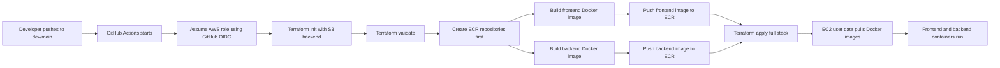
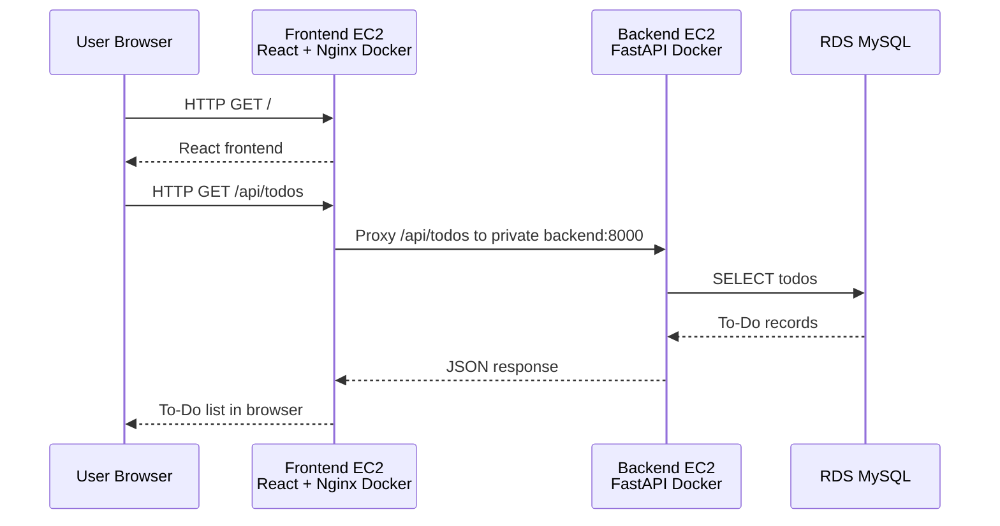

# Dockerized To-Do 3-Tier Application on AWS

This repository deploys a **simple Dockerized To-Do 3-tier application** on AWS using **reusable Terraform modules** and **GitHub Actions**.

The deployment uses separate single instances for each application tier:

- **Frontend:** React JS packaged as a Docker image and deployed on one public EC2 instance.
- **Backend:** FastAPI packaged as a Docker image and deployed on one private EC2 instance.
- **Database:** RDS MySQL deployed in private DB subnets.

The design intentionally excludes **ALB, ASG, Route 53, ACM, Cognito, and app-created KMS**. ECR is included because the EC2 instances pull the frontend and backend Docker images from a private AWS registry.

---

## Architecture Diagram


```text
User Browser
   |
   | HTTP :80
   v
Public Subnet
Frontend EC2 Instance
Docker container: React static build served by Nginx
Nginx proxies /api requests
   |
   | Private traffic :8000
   v
Private App Subnet
Backend EC2 Instance
Docker container: FastAPI + Uvicorn
   |
   | Private traffic :3306
   v
Private DB Subnets
RDS MySQL
```

---

## Deployment Flow Diagram




---

## Application Request Flow




---

## High-Level Resource Design

| Tier | AWS Resource | Subnet Type | Internet Facing | Runtime |
|---|---|---|---|---|
| Frontend | Single EC2 instance | Public subnet | Yes | Docker container from ECR |
| Backend | Single EC2 instance | Private app subnet | No | Docker container from ECR |
| Database | RDS MySQL | Private DB subnets | No | Managed database |
| Image registry | Amazon ECR | AWS regional service | No direct public access | Stores Docker images |
| Network egress | NAT Gateway | Public subnet | Outbound only | Allows private EC2 to pull images/packages |

The frontend and backend are **not deployed on the same server**. They are two separate EC2 instances.

---

## What This Deployment Creates

```text
VPC
Public subnet(s)
Private app subnet(s)
Private DB subnet(s)
Internet Gateway
NAT Gateway and Elastic IP
Route tables and associations
Security groups
ECR frontend repository
ECR backend repository
Frontend EC2 instance
Backend EC2 instance
EC2 IAM role and instance profile for ECR image pull
RDS MySQL database
S3-only Terraform remote state configuration
```

---

## What Is Excluded

```text
No ALB
No ASG
No Route 53
No ACM
No Cognito
No app-created KMS key
No DynamoDB state locking
No Kubernetes
```

---

## Repository Structure

```text
.
├── .github
│   └── workflows
│       └── deploy.yml
├── assets
│   ├── architecture-diagram.svg
│   ├── deployment-flow.svg
│   └── request-flow.svg
├── backend
│   ├── Dockerfile
│   ├── .dockerignore
│   ├── main.py
│   └── requirements.txt
├── frontend
│   ├── Dockerfile
│   ├── .dockerignore
│   ├── index.html
│   ├── package.json
│   └── src
│       ├── App.jsx
│       └── style.css
├── terraform
│   ├── main.tf
│   ├── variables.tf
│   ├── outputs.tf
│   ├── versions.tf
│   ├── terraform.tfvars.example
│   ├── templates
│   │   ├── user_data_frontend.sh.tftpl
│   │   └── user_data_backend.sh.tftpl
│   └── modules
│       ├── network
│       ├── security-groups
│       ├── ecr
│       ├── compute
│       └── database
└── docs
    ├── architecture.md
    └── github-actions-iam-policy.json
```

---

## Terraform Module Design

### `terraform/modules/network`

Creates the network foundation:

```text
VPC
Internet Gateway
Public subnets
Private app subnets
Private DB subnets
NAT Gateway
Public route table
Private route table
Route table associations
```

The private backend EC2 needs outbound access to pull Docker images from ECR. This simplified version uses a NAT Gateway for that outbound path.

### `terraform/modules/security-groups`

Creates the security groups and tier-to-tier rules:

```text
Internet -> Frontend EC2 :80
Optional SSH CIDR -> Frontend EC2 :22
Frontend EC2 -> Backend EC2 :8000
Backend EC2 -> RDS MySQL :3306
```

### `terraform/modules/ecr`

Creates two repositories:

```text
<project-name>/<environment>/todo-frontend
<project-name>/<environment>/todo-backend
```

Example:

```text
todo-3tier-simple/dev/todo-frontend
todo-3tier-simple/dev/todo-backend
```

### `terraform/modules/compute`

Creates two separate EC2 instances:

```text
aws_instance.frontend
aws_instance.backend
```

It also creates an EC2 IAM role and instance profile that allows the EC2 instances to pull Docker images from ECR.

### `terraform/modules/database`

Creates:

```text
RDS DB subnet group
RDS MySQL database instance
```

---

## Docker Packaging

### Frontend Docker Image

The frontend image uses a multi-stage Docker build:

```text
Node.js stage builds the React app
Nginx stage serves the compiled static files
```

At deployment time, the frontend EC2 runs the container on port `80`. Nginx proxies `/api` requests to the backend EC2 private IP on port `8000`.

### Backend Docker Image

The backend image runs:

```text
FastAPI
Uvicorn
MySQL connector
```

The backend EC2 runs the container on port `8000`. Database values are passed through Docker environment variables from EC2 user data.

---

## Database Initialization

FastAPI initializes the database on startup.

It creates this table if it does not already exist:

```sql
CREATE TABLE IF NOT EXISTS todos (
    id INT AUTO_INCREMENT PRIMARY KEY,
    title VARCHAR(255) NOT NULL,
    completed BOOLEAN DEFAULT FALSE,
    created_at TIMESTAMP DEFAULT CURRENT_TIMESTAMP
);
```

It also inserts one test item automatically:

```text
Test To-Do item created during application initialization
```

The seed operation is idempotent, so the application does not duplicate the test item every time the backend restarts.

---

## GitHub Actions Deployment Configuration

Workflow file:

```text
.github/workflows/deploy.yml
```

The workflow uses GitHub OIDC to assume this AWS role:

```text
arn:aws:iam::866934333672:role/react-js-application-github-actions-bootstrap-role
```

### Workflow Behavior

```text
Pull/manual plan:
terraform init
terraform validate
terraform plan

Apply:
terraform init
terraform validate
terraform apply -target=module.ecr
Docker login to ECR
Build frontend Docker image
Build backend Docker image
Push latest and Git SHA image tags
terraform apply full stack
Show Terraform outputs
```

### Image Tags

The workflow pushes two tags for each image:

```text
latest
<git-sha>
```

Terraform deploys the `latest` tag by default.

---

## Required GitHub Repository Variables

Add these under:

```text
GitHub repository -> Settings -> Secrets and variables -> Actions -> Variables
```

```text
AWS_REGION=us-east-1
PROJECT_NAME=todo-3tier-simple
ENVIRONMENT=dev
BOOTSTRAP_ROLE_ARN=arn:aws:iam::866934333672:role/react-js-application-github-actions-bootstrap-role
TERRAFORM_VERSION=1.9.0
TF_STATE_BUCKET=react-js-application-terraform-state-866934333672
ALLOWED_SSH_CIDR=<your-public-ip>/32
```

For a temporary open SSH test only, use:

```text
ALLOWED_SSH_CIDR=0.0.0.0/0
```

For better security, use your public IP:

```text
ALLOWED_SSH_CIDR=72.45.10.20/32
```

---

## Required GitHub Secret

Add this under:

```text
GitHub repository -> Settings -> Secrets and variables -> Actions -> Secrets
```

```text
DB_PASSWORD=<strong-rds-password>
```

---

## Terraform Backend Configuration

This project uses an existing S3 bucket for Terraform state:

```text
TF_STATE_BUCKET=react-js-application-terraform-state-866934333672
```

The workflow runs:

```bash
terraform init \
  -backend-config="bucket=${TF_STATE_BUCKET}" \
  -backend-config="key=${PROJECT_NAME}/${ENVIRONMENT}/terraform.tfstate" \
  -backend-config="region=${AWS_REGION}" \
  -backend-config="encrypt=true"
```

This package intentionally does **not** use:

```text
TF_LOCK_TABLE
TF_STATE_KMS_KEY_ARN
TF_STATE_KMS_KEY_ID
DynamoDB backend locking
KMS backend configuration
```

---

## Required AWS IAM Permissions for Deployment Role

The GitHub Actions role must be able to create and manage this small stack. At minimum, it needs permissions for:

```text
ECR repository management and image push
EC2 VPC, subnet, route, NAT, EIP, security group, and instance management
IAM role and instance profile management for EC2 ECR pull
RDS database and DB subnet group management
S3 Terraform backend state read/write
```

The deployment role used by this project is:

```text
react-js-application-github-actions-bootstrap-role
```

A starter IAM policy is included here:

```text
docs/github-actions-iam-policy.json
```

Recent permissions required during deployment include:

```text
ecr:CreateRepository
ecr:InitiateLayerUpload
ecr:UploadLayerPart
ecr:CompleteLayerUpload
ecr:PutImage
ecr:ListTagsForResource
ec2:DescribeAvailabilityZones
ec2:DescribeImages
ec2:CreateVpc
ec2:AllocateAddress
ec2:DescribeVpcAttribute
ec2:DescribeAddressesAttribute
iam:CreateRole
iam:CreateInstanceProfile
iam:TagInstanceProfile
iam:PassRole
rds:CreateDBInstance
```

---

## Deployment Steps

### 1. Add GitHub variables and secret

Create the required variables and `DB_PASSWORD` secret listed above.

### 2. Push to the deployment branch

The workflow runs on pushes to:

```text
dev
main
```

### 3. First apply creates ECR repositories

The workflow first runs:

```bash
terraform apply -target=module.ecr -auto-approve
```

This creates the ECR repositories before Docker tries to push images.

### 4. Docker images are built and pushed

The workflow builds:

```text
frontend Docker image
backend Docker image
```

Then pushes both images to ECR with `latest` and Git SHA tags.

### 5. Full Terraform apply deploys the stack

The workflow then runs:

```bash
terraform apply -auto-approve
```

This deploys the network, security groups, EC2 instances, and RDS database.

### 6. EC2 user data starts containers

Frontend EC2 pulls and runs:

```text
todo-3tier-simple/dev/todo-frontend:latest
```

Backend EC2 pulls and runs:

```text
todo-3tier-simple/dev/todo-backend:latest
```

---

## Test the Application

After deployment, get the frontend URL:

```bash
terraform output frontend_url
```

Open it in a browser, or test the API through the frontend proxy:

```bash
curl http://<frontend-public-ip>/api/todos
```

Create another test record:

```bash
curl -X POST http://<frontend-public-ip>/api/seed
```

Expected result from `/api/todos`:

```json
[
  {
    "id": 1,
    "title": "Test To-Do item created during application initialization",
    "completed": false
  }
]
```

---

## Local Terraform Commands

```bash
cd terraform
terraform fmt -recursive
terraform init \
  -backend-config="bucket=react-js-application-terraform-state-866934333672" \
  -backend-config="key=todo-3tier-simple/dev/terraform.tfstate" \
  -backend-config="region=us-east-1" \
  -backend-config="encrypt=true"
terraform validate
terraform apply -target=module.ecr -auto-approve
terraform apply -auto-approve
```

---

## Local Docker Build Test

Frontend:

```bash
docker build -t todo-frontend:local ./frontend
```

Backend:

```bash
docker build -t todo-backend:local ./backend
```

---

## Operational Notes

- Frontend EC2 is the only public application instance.
- Backend EC2 is private and receives traffic only from the frontend security group.
- RDS is private and receives traffic only from the backend security group.
- Backend EC2 requires outbound access to ECR and package repositories; this package uses a NAT Gateway.
- S3 remote state is used without DynamoDB locking.
- No ALB or ASG means there is no high availability or automatic scaling.
- This is a learning/demo architecture, not a production HA design.

---

## Final Summary

This project deploys a Dockerized To-Do app using a simple 3-tier AWS design:

```text
React JS frontend container -> public EC2
FastAPI backend container -> private EC2
RDS MySQL database -> private DB subnet
Terraform state -> existing S3 bucket
Deployment automation -> GitHub Actions with OIDC
Docker registry -> Amazon ECR
```
