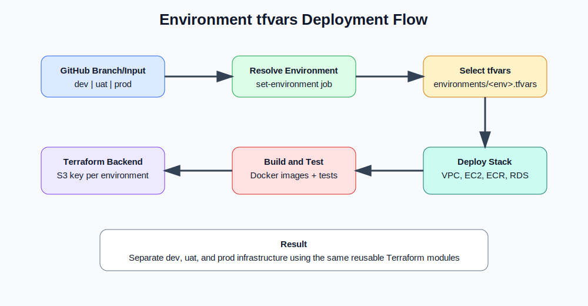

# Dockerized To-Do 3-Tier Application on AWS

This repository deploys a simplified Dockerized 3-tier To-Do application on AWS using reusable Terraform modules and a GitHub Actions pipeline broken into **dev build**, **dev test**, and **dev deploy** stages.

The design intentionally avoids advanced production components so the infrastructure is easy to understand and troubleshoot.

## What This Project Deploys

- React JS frontend packaged as a Docker image.
- FastAPI backend packaged as a Docker image.
- Frontend runs on a dedicated single EC2 instance in a public subnet.
- Backend runs on a dedicated single EC2 instance in a private subnet.
- RDS MySQL runs in private DB subnets.
- ECR stores frontend and backend Docker images.
- Terraform uses reusable modules.
- GitHub Actions uses OIDC to assume an AWS IAM role.
- Terraform state is stored in an existing S3 bucket.
- FastAPI initializes the database and inserts a test To-Do item.

## Excluded by Design

This simplified version does **not** use:

- ALB
- ASG
- Route 53
- ACM
- Cognito
- Application-created KMS key
- DynamoDB state locking


## Diagram Flow Overview

This repository includes three diagram assets in the `assets/` folder. These diagrams are referenced directly in this README and can also be opened separately from GitHub.

| Diagram | File | What It Shows |
|---|---|---|
| Architecture diagram | `assets/architecture-diagram.svg` | AWS 3-tier layout with public frontend EC2, private backend EC2, private RDS, ECR, S3 state, and GitHub Actions |
| Deployment flow | `assets/deployment-flow.svg` | CI/CD path from GitHub push through dev validate, build, test, and deploy |
| Request flow | `assets/request-flow.svg` | Browser request path through frontend Nginx proxy, FastAPI backend, and RDS MySQL |
| Promotion flow | `assets/promotion-flow.svg` | Branch promotion guard: only `dev → uat`, then `uat → prod` with production approval gate |

### Architecture Diagram Flow

```text
GitHub Actions
  -> Assumes AWS OIDC IAM role
  -> Builds Docker images
  -> Pushes images to Amazon ECR
  -> Runs Terraform using S3 remote state
  -> Creates VPC, subnets, security groups, EC2, ECR, and RDS

User Browser
  -> Public Frontend EC2 :80
  -> React app served by Nginx
  -> /api traffic proxied to private Backend EC2 :8000
  -> FastAPI reads/writes To-Do data
  -> RDS MySQL :3306
```


### Deployment Pipeline Flow

```text
Developer pushes to dev branch
  -> GitHub Actions starts
  -> Dev Validate
      -> Check required variables
      -> Configure AWS OIDC credentials
      -> Terraform fmt/init/validate
  -> Dev Build
      -> Ensure ECR repositories exist
      -> Build frontend Docker image
      -> Build backend Docker image
      -> Push latest and Git SHA image tags
  -> Dev Test
      -> Login to ECR again because this is a new runner
      -> Pull pushed images
      -> Run frontend container locally
      -> Run temporary MySQL test container
      -> Run backend container locally
      -> Test frontend and backend health endpoints
  -> Dev Deploy
      -> Terraform plan/apply
      -> EC2 instances pull Docker images
      -> Backend initializes database
      -> Frontend serves the To-Do UI
```


### Application Request Flow

```text
1. User opens http://<frontend-public-ip>
2. Frontend EC2 receives HTTP request on port 80
3. Nginx serves React static files
4. React calls /api/todos
5. Nginx proxies /api traffic to backend private IP on port 8000
6. FastAPI handles the request
7. FastAPI connects to RDS MySQL on port 3306
8. RDS returns To-Do data
9. FastAPI returns JSON response
10. React updates the browser UI
```


### Environment Promotion Flow

The workflow enforces controlled promotion between environments. Pull requests are allowed only in this order:

```text
dev branch
  -> Pull request into uat
  -> Merge to uat deploys the UAT environment
  -> Pull request from uat into prod
  -> Merge to prod waits for GitHub Environment approval
  -> Approved prod deployment runs Terraform with prod.tfvars
```

Invalid promotion paths are blocked by the `validate-promotion-path` job. Examples of blocked paths:

```text
feature -> uat
feature -> prod
dev -> prod
prod -> uat
```


## Complete Repository and Terraform Structure

```text
todo-3tier-reusable-github-actions/
├── .github/
│   └── workflows/
│       └── deploy.yml
├── assets/
│   ├── architecture-diagram.svg
│   ├── deployment-flow.svg
│   ├── request-flow.svg
│   └── promotion-flow.svg
├── backend/
│   ├── Dockerfile
│   ├── .dockerignore
│   ├── main.py
│   └── requirements.txt
├── frontend/
│   ├── Dockerfile
│   ├── .dockerignore
│   ├── index.html
│   ├── package.json
│   └── src/
│       ├── App.jsx
│       └── style.css
├── docs/
│   ├── architecture.md
│   └── github-actions-iam-policy.json
├── terraform/
│   ├── main.tf
│   ├── variables.tf
│   ├── outputs.tf
│   ├── versions.tf
│   ├── terraform.tfvars.example
│   ├── backend-values.example.txt
│   ├── modules/
│   │   ├── network/
│   │   │   ├── main.tf
│   │   │   ├── variables.tf
│   │   │   └── outputs.tf
│   │   ├── security-groups/
│   │   │   ├── main.tf
│   │   │   ├── variables.tf
│   │   │   └── outputs.tf
│   │   ├── ecr/
│   │   │   ├── main.tf
│   │   │   ├── variables.tf
│   │   │   └── outputs.tf
│   │   ├── compute/
│   │   │   ├── main.tf
│   │   │   ├── variables.tf
│   │   │   └── outputs.tf
│   │   └── database/
│   │       ├── main.tf
│   │       ├── variables.tf
│   │       └── outputs.tf
│   └── templates/
│       ├── user_data_frontend.sh.tftpl
│       └── user_data_backend.sh.tftpl
├── .gitignore
└── README.md
```

### Terraform Root Module Flow

The root Terraform files inside `terraform/` call the reusable modules and pass outputs from one module into another.

```text
terraform/main.tf
  -> data.aws_availability_zones.available
  -> data.aws_ami.ubuntu
  -> module.network
      -> creates VPC, public subnet, private app subnet, private DB subnets, IGW, NAT Gateway, route tables
  -> module.security_groups
      -> creates frontend, backend, and database security groups
  -> module.ecr
      -> creates frontend and backend ECR repositories
  -> module.database
      -> creates RDS subnet group and RDS MySQL database
  -> module.compute
      -> creates EC2 ECR pull role and instance profile
      -> creates frontend public EC2 instance
      -> creates backend private EC2 instance
      -> injects Docker image URIs and RDS connection values into user data
```

### Terraform Module Dependency Flow

```text
network
  -> outputs VPC ID, public subnet ID, private app subnet ID, DB subnet IDs

security-groups
  -> consumes VPC ID
  -> outputs frontend SG, backend SG, database SG

ecr
  -> outputs frontend repository URL and backend repository URL

database
  -> consumes DB subnet IDs and database SG
  -> outputs RDS endpoint, DB name, DB username

compute
  -> consumes subnet IDs, security groups, ECR image URIs, and RDS endpoint
  -> outputs frontend public IP and backend private IP
```

### Module Purpose Summary

| Terraform Module | Input Dependencies | Main Resources Created | Important Outputs |
|---|---|---|---|
| `network` | CIDR ranges, AZ list, project/environment names | VPC, subnets, IGW, NAT Gateway, route tables | VPC ID, subnet IDs |
| `security-groups` | VPC ID, allowed SSH CIDR | Frontend SG, backend SG, database SG | Security group IDs |
| `ecr` | Project name, environment | Frontend/backend ECR repositories | Repository URLs |
| `database` | DB subnet IDs, DB SG, DB credentials | RDS subnet group, RDS MySQL | DB endpoint, DB name, username |
| `compute` | Subnet IDs, SG IDs, image URIs, DB endpoint | IAM role, instance profile, frontend EC2, backend EC2 | Frontend public IP, backend private IP |

## High-Level Architecture


### Application Components

| Layer | Service | Placement | Purpose |
|---|---|---|---|
| Frontend | React JS + Nginx container | Public EC2 instance | Serves web UI and proxies `/api` requests |
| Backend | FastAPI container | Private EC2 instance | Handles To-Do API and database initialization |
| Database | RDS MySQL | Private DB subnets | Stores To-Do records |
| Container Registry | Amazon ECR | AWS regional service | Stores frontend and backend Docker images |
| CI/CD | GitHub Actions | GitHub-hosted runner | Builds, tests, pushes images, and deploys Terraform |
| State Backend | S3 | Existing bucket | Stores Terraform state |

## Application Request Flow


Request path:

```text
Browser
  -> Frontend EC2 Public IP :80
  -> Nginx serves React app
  -> Nginx proxies /api requests
  -> Backend EC2 Private IP :8000
  -> FastAPI
  -> RDS MySQL :3306
```

Security group flow:

```text
Internet -> Frontend EC2 SG :80
Frontend EC2 SG -> Backend EC2 SG :8000
Backend EC2 SG -> RDS SG :3306
```


## Environment Promotion Rules

The pipeline supports three environments with separate tfvars files:

| Branch | Terraform tfvars file | Deployment behavior | Approval requirement |
|---|---|---|---|
| `dev` | `terraform/environments/dev.tfvars` | Push to `dev` builds, tests, and deploys dev | No approval by default |
| `uat` | `terraform/environments/uat.tfvars` | Only PRs from `dev` are allowed; merge deploys UAT | Optional GitHub Environment approval |
| `prod` | `terraform/environments/prod.tfvars` | Only PRs from `uat` are allowed; merge waits for production approval | Required GitHub Environment approval |

### Pull request promotion guard

The workflow has a `validate-promotion-path` job that runs on pull requests into `uat` and `prod`. It allows only:

```text
dev -> uat
uat -> prod
```

Any other pull request path fails immediately before Terraform validation or deployment.

### Production approval gate

The deploy job uses:

```yaml
environment: ${{ needs.set-environment.outputs.environment }}
```

To enforce approval for production, create a GitHub Environment named exactly:

```text
prod
```

Then configure:

```text
Repository Settings
  -> Environments
  -> prod
  -> Required reviewers
```

When code is merged from `uat` into `prod`, GitHub Actions pauses the `Deploy Infrastructure` job until an approved reviewer approves the `prod` environment deployment.

## GitHub Actions Deployment Flow


The workflow is split into clear dev stages:

```text
Dev Validate
  -> Dev Build Docker Images
  -> Dev Test Docker Images
  -> Dev Deploy Infrastructure
```

### 1. Dev Validate

Runs basic Terraform checks before build/deploy:

```text
Validate required GitHub variables
Configure AWS credentials using GitHub OIDC
Terraform fmt check
Terraform init using S3 backend
Terraform validate
Terraform plan on pull request
```

### 2. Dev Build Docker Images

Builds and pushes the Docker images:

```text
Create/update ECR repositories
Login to Amazon ECR
Build frontend Docker image
Build backend Docker image
Push latest and Git SHA tags
```

Image format:

```text
866934333672.dkr.ecr.us-east-1.amazonaws.com/react-js-application/dev/todo-frontend:<git-sha>
866934333672.dkr.ecr.us-east-1.amazonaws.com/react-js-application/dev/todo-backend:<git-sha>
```

Also pushed as:

```text
latest
```

### 3. Dev Test

Because each GitHub Actions job runs on a new runner, this job logs in to ECR again before pulling images.

Tests include:

```text
Pull frontend image from ECR
Run frontend container locally on port 8080
Test frontend HTTP response
Run temporary MySQL container
Run backend container locally on port 8000
Test backend /health endpoint
```

### 4. Dev Deploy

Deploys the AWS infrastructure and application runtime:

```text
Terraform init with S3 backend
Terraform plan
Terraform apply
Create VPC, subnets, NAT, SGs, EC2, ECR, and RDS
Frontend EC2 pulls frontend image
Backend EC2 pulls backend image
FastAPI initializes RDS table and test data
```

## Terraform Backend Configuration

This project uses an existing S3 bucket for Terraform state.

The workflow uses:

```bash
terraform init \
  -backend-config="bucket=${TF_STATE_BUCKET}" \
  -backend-config="key=${PROJECT_NAME}/${ENVIRONMENT}/terraform.tfstate" \
  -backend-config="region=${AWS_REGION}" \
  -backend-config="encrypt=true"
```

Required state bucket variable:

```text
TF_STATE_BUCKET=react-js-application-terraform-state-866934333672
```

Removed from this simplified project:

```text
TF_LOCK_TABLE
TF_STATE_KMS_KEY_ARN
TF_STATE_KMS_KEY_ID
```

## Required GitHub Repository Variables

Create these under:

```text
GitHub Repo -> Settings -> Secrets and variables -> Actions -> Variables
```

| Variable | Example Value |
|---|---|
| `AWS_REGION` | `us-east-1` |
| `PROJECT_NAME` | `react-js-application` |
| `ENVIRONMENT` | `dev` |
| `BOOTSTRAP_ROLE_ARN` | `arn:aws:iam::866934333672:role/react-js-application-github-actions-bootstrap-role` |
| `TERRAFORM_VERSION` | `1.9.0` |
| `TF_STATE_BUCKET` | `react-js-application-terraform-state-866934333672` |
| `ALLOWED_SSH_CIDR` | `<your-public-ip>/32` |

For quick testing only, you can use:

```text
ALLOWED_SSH_CIDR=0.0.0.0/0
```

For better security, use your public IP with `/32`.

## Required GitHub Secret

Create this under:

```text
GitHub Repo -> Settings -> Secrets and variables -> Actions -> Secrets
```

| Secret | Purpose |
|---|---|
| `DB_PASSWORD` | RDS MySQL admin password |

## AWS OIDC Role

The workflow assumes this role:

```text
arn:aws:iam::866934333672:role/react-js-application-github-actions-bootstrap-role
```

The role must trust GitHub OIDC:

```text
arn:aws:iam::866934333672:oidc-provider/token.actions.githubusercontent.com
```

The workflow uses:

```yaml
permissions:
  id-token: write
  contents: read
```

## Required AWS Permissions for Deployment

The GitHub Actions role needs permissions for:

```text
ECR repository creation and Docker image push
EC2/VPC networking and instance deployment
IAM EC2 instance role and instance profile creation
RDS MySQL deployment
S3 Terraform state read/write
```

A full IAM policy example is included here:

```text
docs/github-actions-iam-policy.json
```

During troubleshooting, full EC2 permission may be temporarily attached:

```json
{
  "Effect": "Allow",
  "Action": "ec2:*",
  "Resource": "*"
}
```

After deployment succeeds, replace broad permissions with scoped least-privilege permissions.

## Terraform Module Structure

```text
terraform/
  main.tf
  variables.tf
  outputs.tf
  versions.tf
  terraform.tfvars.example
  backend-values.example.txt
  modules/
    network/
    security-groups/
    ecr/
    compute/
    database/
  templates/
    user_data_frontend.sh.tftpl
    user_data_backend.sh.tftpl
```

### Module Responsibilities

| Module | Responsibility |
|---|---|
| `network` | VPC, public subnet, private app subnet, private DB subnets, Internet Gateway, NAT Gateway, route tables |
| `security-groups` | Frontend, backend, and database security groups |
| `ecr` | Frontend and backend ECR repositories |
| `compute` | Separate frontend EC2 and backend EC2 instances, EC2 role, instance profile, Docker runtime |
| `database` | RDS MySQL subnet group and database instance |

## Docker Image Build

### Frontend Dockerfile

The frontend container builds the React app and serves it through Nginx.

```text
frontend/Dockerfile
```

Nginx also proxies API traffic:

```text
/api -> backend private IP:8000
```

### Backend Dockerfile

The backend container runs FastAPI with Uvicorn.

```text
backend/Dockerfile
```

FastAPI connects to RDS using environment variables passed from EC2 user data.

## Database Initialization

On backend startup, FastAPI automatically:

```text
Creates the todos table if it does not exist
Inserts one test To-Do item if not already present
Starts the API service
```

Default seed item:

```text
Test To-Do item created during application initialization
```

Useful API endpoints:

```text
GET  /health
GET  /api/todos
POST /api/todos
POST /api/seed
```

## Deployment Commands

The normal deployment path is GitHub Actions.

Push to the dev branch:

```bash
git add .
git commit -m "Deploy dockerized todo 3-tier app"
git push origin dev
```

The workflow file is:

```text
.github/workflows/deploy.yml
```

Manual workflow dispatch supports:

```text
plan
apply
destroy
```

## Local Terraform Commands

From the `terraform` directory:

```bash
terraform fmt -recursive
terraform init \
  -backend-config="bucket=react-js-application-terraform-state-866934333672" \
  -backend-config="key=react-js-application/dev/terraform.tfstate" \
  -backend-config="region=us-east-1" \
  -backend-config="encrypt=true"
terraform validate
terraform plan
```

## Test the Application

After Terraform apply completes, get the frontend public IP from Terraform outputs or EC2 console.

Open in a browser:

```text
http://<frontend-public-ip>
```

Test API through the frontend proxy:

```bash
curl http://<frontend-public-ip>/api/todos
```

Create another seeded test item:

```bash
curl -X POST http://<frontend-public-ip>/api/seed
```

Check health:

```bash
curl http://<frontend-public-ip>/api/health
```

Depending on the Nginx proxy configuration, health may also be available as:

```bash
curl http://<frontend-public-ip>/api/health
```

## Connect to the Database

RDS is private, so connect from the backend EC2 instance or through a tunnel.

From backend EC2:

```bash
sudo apt update
sudo apt install -y mysql-client
mysql -h <rds-endpoint> -P 3306 -u todo_admin -p
```

With SSL CA bundle:

```bash
sudo mkdir -p /certs
sudo curl -o /certs/global-bundle.pem https://truststore.pki.rds.amazonaws.com/global/global-bundle.pem
mysql -h <rds-endpoint> \
  -P 3306 \
  --ssl-mode=VERIFY_IDENTITY \
  --ssl-ca=/certs/global-bundle.pem \
  -u todo_admin \
  -p
```

Then run:

```sql
USE todoapp;
SHOW TABLES;
SELECT * FROM todos;
```

## Operational Notes

- The backend EC2 is private and pulls Docker images from ECR through the NAT Gateway.
- The frontend EC2 is public and serves traffic on port 80.
- RDS is private and only accepts MySQL traffic from the backend security group.
- There is no load balancer, so the application endpoint is the frontend EC2 public IP.
- There is no autoscaling, so each layer uses one instance.
- There is no Route 53/ACM, so the frontend uses plain HTTP for this lab version.

## Cleanup

Use workflow dispatch with:

```text
destroy
```

or run locally:

```bash
terraform destroy
```

This removes the lab infrastructure created by Terraform.

## Summary

This project is a simple, interview-ready, hands-on 3-tier AWS deployment:

```text
React Docker container on public EC2
FastAPI Docker container on private EC2
RDS MySQL in private DB subnets
ECR for container images
Terraform reusable modules
GitHub Actions dev build, test, and deploy pipeline
S3-only Terraform backend
```


## Environment-specific Terraform tfvars files

### Environment tfvars flow diagram




This project now supports separate Terraform variable files per environment. Each environment has its own VPC CIDR, subnet CIDRs, instance sizing, database sizing, and tags. The deployment workflow automatically selects the correct file based on the branch or manual workflow input.

```text
terraform/
├── environments/
│   ├── dev.tfvars
│   ├── uat.tfvars
│   └── prod.tfvars
├── main.tf
├── variables.tf
├── outputs.tf
├── versions.tf
├── modules/
│   ├── network/
│   ├── security-groups/
│   ├── ecr/
│   ├── compute/
│   └── database/
└── templates/
    ├── user_data_frontend.sh.tftpl
    └── user_data_backend.sh.tftpl
```

### Environment branch mapping

```text
dev branch  -> terraform/environments/dev.tfvars  -> dev environment
uat branch  -> terraform/environments/uat.tfvars  -> uat environment
prod branch -> terraform/environments/prod.tfvars -> prod environment
```

### Remote state path per environment

The GitHub Actions workflow uses one S3 bucket, but stores each environment in a separate state key:

```text
s3://react-js-application-terraform-state-866934333672/react-js-application/dev/terraform.tfstate
s3://react-js-application-terraform-state-866934333672/react-js-application/uat/terraform.tfstate
s3://react-js-application-terraform-state-866934333672/react-js-application/prod/terraform.tfstate
```

### What belongs in each tfvars file

Each `.tfvars` file contains non-sensitive environment configuration:

```hcl
aws_region   = "us-east-1"
project_name = "react-js-application"
environment  = "dev"

vpc_cidr                 = "10.40.0.0/16"
public_subnet_cidrs      = ["10.40.1.0/24", "10.40.2.0/24"]
private_app_subnet_cidrs = ["10.40.11.0/24", "10.40.12.0/24"]
private_db_subnet_cidrs  = ["10.40.21.0/24", "10.40.22.0/24"]

instance_type        = "t3.micro"
db_instance_class    = "db.t3.micro"
db_allocated_storage = 20
```

Do not store database passwords in `.tfvars`. The workflow passes the database password securely from the GitHub secret:

```text
DB_PASSWORD
```

### Manual deployment by environment

Use **Actions → Build, Test, and Deploy Todo App → Run workflow**, then choose:

```text
environment: dev | uat | prod
terraform_action: plan | apply | destroy
```

### CI/CD flow with environment tfvars

```text
GitHub branch or manual input
        |
        v
Resolve environment
        |
        v
Select terraform/environments/<env>.tfvars
        |
        v
Terraform init with S3 backend key: react-js-application/<env>/terraform.tfstate
        |
        v
Terraform validate and plan
        |
        v
Build Docker images
        |
        v
Push images to ECR path: react-js-application/<env>/...
        |
        v
Test containers
        |
        v
Terraform apply using the selected tfvars file
```

---

## Fix: required environment tfvars files

The deploy workflow validates that the environment-specific tfvars file exists before running Terraform:

```text
terraform/environments/dev.tfvars
terraform/environments/uat.tfvars
terraform/environments/prod.tfvars
```

The selected file is based on branch or manual workflow input:

```text
dev branch  -> terraform/environments/dev.tfvars
uat branch  -> terraform/environments/uat.tfvars
prod branch -> terraform/environments/prod.tfvars
```

Do not place these files under `.github/workflows` or another folder. They must stay under `terraform/environments/` because the deploy workflow runs Terraform from the `terraform` directory and passes:

```bash
-var-file="environments/${ENVIRONMENT}.tfvars"
```


## Repository Folder Layout Update

This project is designed to live inside a repository repository root. The GitHub workflows remain at the repository root under `.github/workflows`, while application and Terraform code live under ``.

```text
repo-root/
├── .github/
│   └── workflows/
│       ├── docker-build-push.yml
│       └── deploy.yml
└── 
    ├── frontend/
    ├── backend/
    ├── terraform/
    │   ├── environments/
    │   │   ├── dev.tfvars
    │   │   ├── uat.tfvars
    │   │   └── prod.tfvars
    │   ├── modules/
    │   │   ├── network/
    │   │   ├── security-groups/
    │   │   ├── ecr/
    │   │   ├── compute/
    │   │   └── database/
    │   ├── templates/
    │   ├── main.tf
    │   ├── variables.tf
    │   ├── outputs.tf
    │   └── versions.tf
    ├── assets/
    └── docs/
```

### Workflow path configuration

Both workflows now use:

```yaml
env:
  APP_DIR: .
```

Terraform commands run from:

```text
terraform
```

The environment tfvars files are resolved as:

```text
terraform/environments/dev.tfvars
terraform/environments/uat.tfvars
terraform/environments/prod.tfvars
```

Docker build contexts are:

```text
frontend
backend
```
