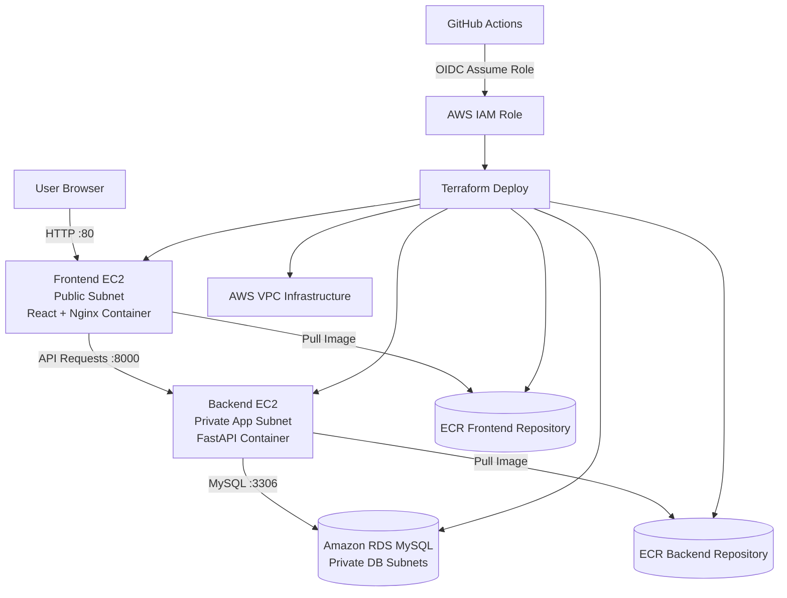
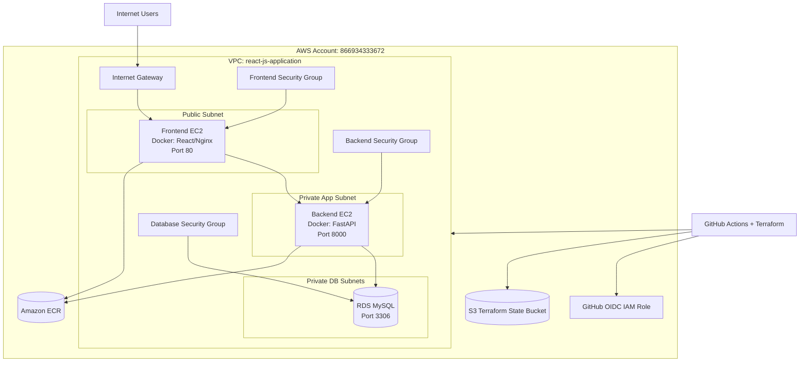
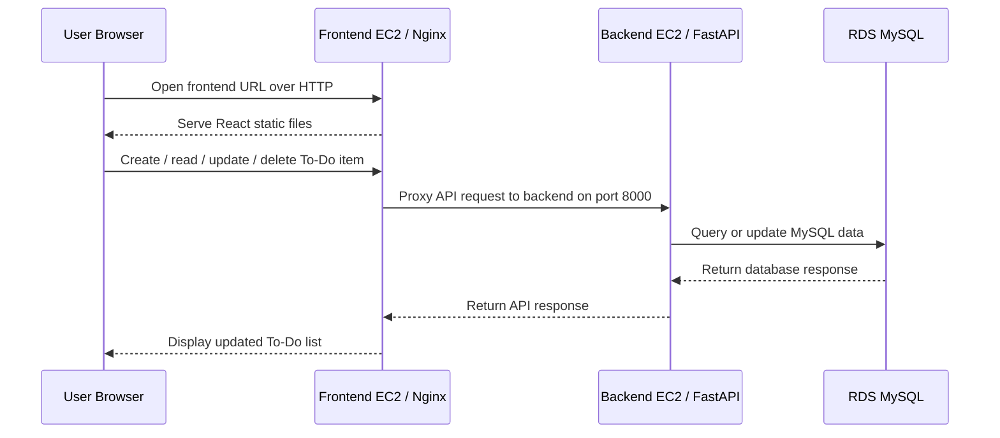
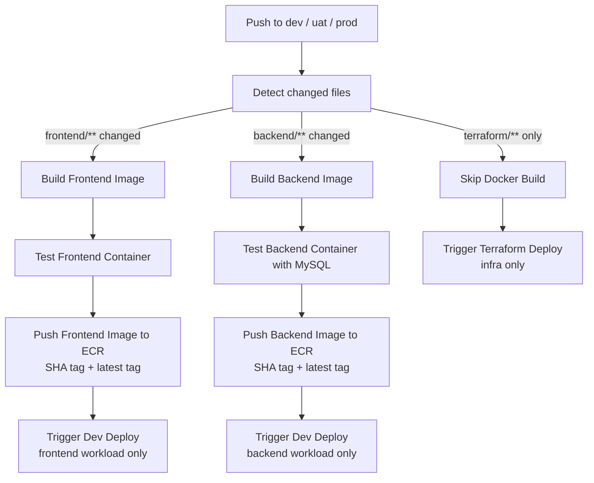
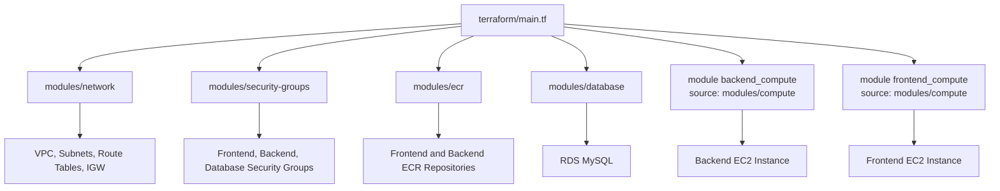
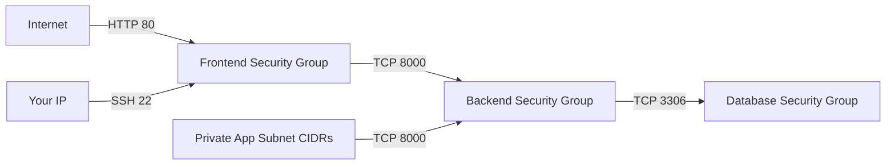
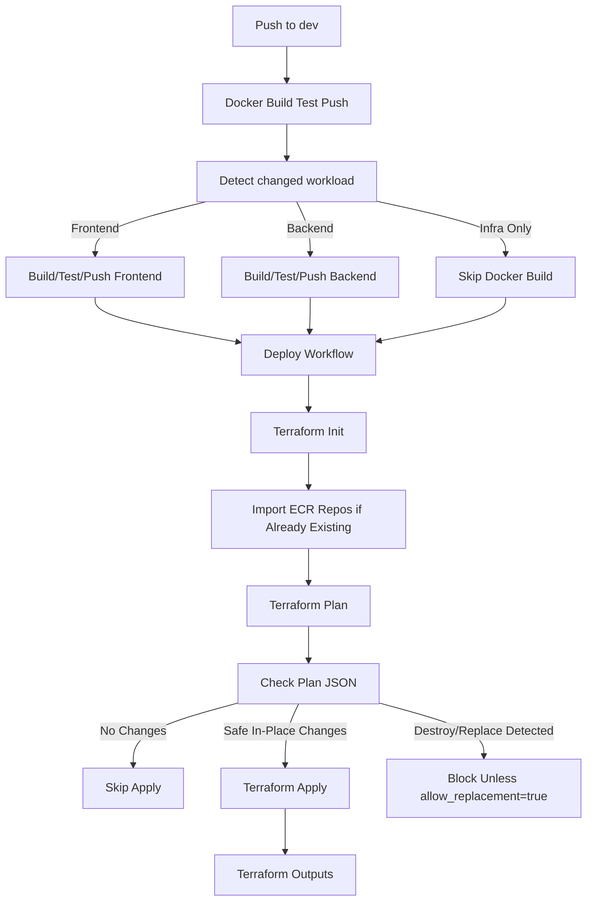
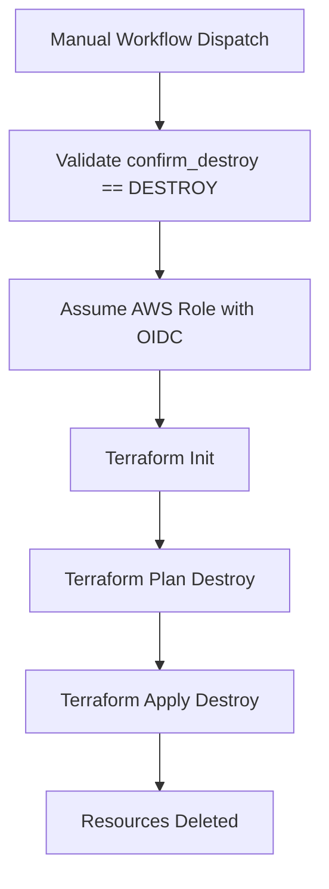

# React JS Application – 3-Tier AWS Deployment

## Project Overview

This repository deploys a Dockerized 3-tier To-Do application on AWS using Terraform and GitHub Actions.

The application is composed of:

| Tier | Technology | AWS Placement |
|---|---|---|
| Frontend | React + Nginx container | Public EC2 instance |
| Backend | FastAPI container | Private EC2 instance |
| Database | MySQL | Amazon RDS in private DB subnets |

The infrastructure is provisioned with Terraform, Docker images are stored in Amazon ECR, and CI/CD is handled with GitHub Actions using AWS OIDC authentication.

---

## Current Project Name

```text
react-js-application
```

The ECR repositories use this naming pattern:

```text
react-js-application/<environment>/todo-frontend
react-js-application/<environment>/todo-backend
```

Example for dev:

```text
866934333672.dkr.ecr.us-east-1.amazonaws.com/react-js-application/dev/todo-frontend:latest
866934333672.dkr.ecr.us-east-1.amazonaws.com/react-js-application/dev/todo-backend:latest
```

---

## Repository Structure

```text
repo-root/
├── .github/
│   └── workflows/
│       ├── docker-build-push.yml
│       ├── deploy.yml
│       └── destroy.yml
├── frontend/
│   ├── Dockerfile
│   └── ...
├── backend/
│   ├── Dockerfile
│   └── ...
├── terraform/
│   ├── main.tf
│   ├── variables.tf
│   ├── outputs.tf
│   ├── moved.tf
│   ├── versions.tf
│   ├── environments/
│   │   ├── dev.tfvars
│   │   ├── uat.tfvars
│   │   └── prod.tfvars
│   ├── modules/
│   │   ├── network/
│   │   ├── security-groups/
│   │   ├── ecr/
│   │   ├── database/
│   │   └── compute/
│   └── templates/
│       ├── user_data_frontend.sh.tftpl
│       └── user_data_backend.sh.tftpl
├── README.md
└── .gitignore
```

---

## AWS Services Used

| AWS Service | Purpose |
|---|---|
| VPC | Isolated network for the application |
| Public Subnets | Host the frontend EC2 instance |
| Private App Subnets | Host the backend EC2 instance |
| Private DB Subnets | Host the RDS database |
| Internet Gateway | Allows public internet access for frontend |
| Route Tables | Controls traffic routing between subnets |
| Security Groups | Controls inbound/outbound traffic |
| EC2 | Runs Docker containers for frontend and backend |
| IAM Role / Instance Profile | Allows EC2 to pull Docker images from ECR |
| ECR | Stores frontend and backend Docker images |
| RDS MySQL | Stores application data |
| S3 Backend | Stores Terraform remote state |
| GitHub Actions OIDC | Allows GitHub Actions to assume AWS IAM role securely |

---

## High-Level Architecture Diagram



---

## AWS Network Architecture Diagram



---

## Application Request Flow



---

## CI/CD Flow

The project uses separate workflows for image build, deployment, and destroy.

| Workflow | Purpose |
|---|---|
| `docker-build-push.yml` | Builds, tests, and pushes Docker images to ECR |
| `deploy.yml` | Runs Terraform plan/apply for infrastructure and image updates |
| `destroy.yml` | Runs Terraform destroy manually with confirmation |

---

## Docker Build/Test/Push Flow



---

## Workload-Specific Image Deployment

The deployment is designed so frontend and backend updates are isolated.

### Frontend Change

```text
frontend/** changes
```

Result:

```text
Build frontend image only
Push frontend image with SHA and latest tags
Deploy only module.frontend_compute
Backend infrastructure is not modified
```

### Backend Change

```text
backend/** changes
```

Result:

```text
Build backend image only
Push backend image with SHA and latest tags
Deploy only module.backend_compute
Frontend infrastructure is not modified
```

### Infrastructure Change

```text
terraform/** changes
```

Result:

```text
Skip Docker image build
Run Terraform infrastructure plan/apply
Use existing image tags
```

---

## Terraform Architecture

The root Terraform module separates backend and frontend compute workloads using the same reusable compute module.

```hcl
module "backend_compute" {
  source = "./modules/compute"

  workload_name               = "backend"
  instance_type               = var.backend_instance_type
  subnet_id                   = module.network.private_app_subnet_ids[0]
  security_group_id           = module.security_groups.backend_security_group_id
  associate_public_ip_address = false
  image_uri                   = local.backend_image_uri
  user_data_template_path     = "${path.module}/templates/user_data_backend.sh.tftpl"
}

module "frontend_compute" {
  source = "./modules/compute"

  workload_name               = "frontend"
  instance_type               = var.frontend_instance_type
  subnet_id                   = module.network.public_subnet_ids[0]
  security_group_id           = module.security_groups.frontend_security_group_id
  associate_public_ip_address = true
  image_uri                   = local.frontend_image_uri
  user_data_template_path     = "${path.module}/templates/user_data_frontend.sh.tftpl"
}
```

---

## Terraform Module Diagram



---

## Terraform Variables

Key variables:

```hcl
project_name = "react-js-application"
environment  = "dev"
aws_region   = "us-east-1"

frontend_instance_type = "t3.micro"
backend_instance_type  = "t3.micro"

frontend_image_tag = "latest"
backend_image_tag  = "latest"
```

---

## Environment Defaults

| Environment | Frontend Instance | Backend Instance | DB Instance |
|---|---:|---:|---:|
| dev | `t3.micro` | `t3.micro` | `db.t3.micro` |
| uat | `t3.micro` | `t3.small` | `db.t3.micro` |
| prod | `t3.small` | `t3.medium` | `db.t3.small` |

---

## Terraform State Backend

The project uses an S3 backend for Terraform state.

Example state key:

```text
react-js-application/dev/terraform.tfstate
```

Terraform init example:

```bash
terraform init \
  -backend-config="bucket=react-js-application-terraform-state-866934333672" \
  -backend-config="key=react-js-application/dev/terraform.tfstate" \
  -backend-config="region=us-east-1" \
  -backend-config="encrypt=true"
```

---

## GitHub Repository Variables

Configure these under:

```text
GitHub Repository → Settings → Secrets and variables → Actions → Variables
```

| Variable | Example |
|---|---|
| `AWS_REGION` | `us-east-1` |
| `AWS_ACCOUNT_ID` | `866934333672` |
| `PROJECT_NAME` | `react-js-application` |
| `BOOTSTRAP_ROLE_ARN` | `arn:aws:iam::866934333672:role/Reactjs-application-role` |
| `TF_STATE_BUCKET` | `react-js-application-terraform-state-866934333672` |
| `TERRAFORM_VERSION` | `1.9.0` |

---

## GitHub Repository Secrets

Configure these under:

```text
GitHub Repository → Settings → Secrets and variables → Actions → Secrets
```

| Secret | Purpose |
|---|---|
| `DB_PASSWORD` | RDS MySQL password used by Terraform and backend container |

---

## GitHub OIDC Trust Policy

The GitHub Actions role must trust your repo.

Example current-repo wildcard trust policy:

```json
{
  "Version": "2012-10-17",
  "Statement": [
    {
      "Sid": "AllowCurrentRepoGitHubActionsOIDC",
      "Effect": "Allow",
      "Principal": {
        "Federated": "arn:aws:iam::866934333672:oidc-provider/token.actions.githubusercontent.com"
      },
      "Action": "sts:AssumeRoleWithWebIdentity",
      "Condition": {
        "StringEquals": {
          "token.actions.githubusercontent.com:aud": "sts.amazonaws.com"
        },
        "StringLike": {
          "token.actions.githubusercontent.com:sub": "repo:Olalekog/todo-3tier-app:*"
        }
      }
    }
  ]
}
```

If your repo is named `react-js-application`, use:

```text
repo:Olalekog/react-js-application:*
```

---

## Security Group Flow



---

## Deployment Flow



---

## Destroy Flow

Destroy is handled by a separate workflow:

```text
.github/workflows/destroy.yml
```

Run manually from GitHub Actions:

```text
Actions → Destroy Infrastructure → Run workflow
```

Inputs:

```text
environment: dev
confirm_destroy: DESTROY
image_tag: latest
frontend_image_tag: latest
backend_image_tag: latest
```

Destroy workflow flow:



---

## Deployment Commands

### Terraform Init

```bash
cd terraform

terraform init \
  -backend-config="bucket=react-js-application-terraform-state-866934333672" \
  -backend-config="key=react-js-application/dev/terraform.tfstate" \
  -backend-config="region=us-east-1" \
  -backend-config="encrypt=true"
```

### Terraform Plan

```bash
terraform plan \
  -var-file="environments/dev.tfvars" \
  -var="aws_region=us-east-1" \
  -var="project_name=react-js-application" \
  -var="db_password=$DB_PASSWORD" \
  -var="frontend_image_tag=latest" \
  -var="backend_image_tag=latest"
```

### Terraform Apply

```bash
terraform apply -auto-approve
```

### Terraform Destroy

```bash
terraform destroy \
  -var-file="environments/dev.tfvars" \
  -var="aws_region=us-east-1" \
  -var="project_name=react-js-application" \
  -var="db_password=$DB_PASSWORD" \
  -var="frontend_image_tag=latest" \
  -var="backend_image_tag=latest" \
  -auto-approve
```

---

## ECR Image Validation

Check frontend tags:

```bash
aws ecr describe-images \
  --region us-east-1 \
  --repository-name react-js-application/dev/todo-frontend \
  --query "imageDetails[*].imageTags" \
  --output table
```

Check backend tags:

```bash
aws ecr describe-images \
  --region us-east-1 \
  --repository-name react-js-application/dev/todo-backend \
  --query "imageDetails[*].imageTags" \
  --output table
```

Expected tags:

```text
latest
<commit-sha>
```

---

## Manual Frontend Container Recovery

If frontend user data failed because the image tag was missing, SSH to the frontend EC2 instance and run:

```bash
export AWS_REGION="us-east-1"
export AWS_ACCOUNT_ID="866934333672"

aws ecr get-login-password --region "$AWS_REGION" | \
sudo docker login --username AWS --password-stdin "$AWS_ACCOUNT_ID.dkr.ecr.$AWS_REGION.amazonaws.com"

sudo docker pull 866934333672.dkr.ecr.us-east-1.amazonaws.com/react-js-application/dev/todo-frontend:latest

sudo docker rm -f todo-frontend 2>/dev/null || true

sudo docker run -d \
  --name todo-frontend \
  --restart unless-stopped \
  -p 80:80 \
  866934333672.dkr.ecr.us-east-1.amazonaws.com/react-js-application/dev/todo-frontend:latest

sudo docker ps
curl -I http://localhost
```

---

## Manual Backend Container Recovery

SSH into the backend EC2 instance and run:

```bash
export AWS_REGION="us-east-1"
export AWS_ACCOUNT_ID="866934333672"

aws ecr get-login-password --region "$AWS_REGION" | \
sudo docker login --username AWS --password-stdin "$AWS_ACCOUNT_ID.dkr.ecr.$AWS_REGION.amazonaws.com"

sudo docker pull 866934333672.dkr.ecr.us-east-1.amazonaws.com/react-js-application/dev/todo-backend:latest

sudo docker rm -f todo-backend 2>/dev/null || true

sudo docker run -d \
  --name todo-backend \
  --restart unless-stopped \
  -p 8000:8000 \
  -e DB_HOST="<RDS_ENDPOINT>" \
  -e DB_PORT="3306" \
  -e DB_NAME="todoapp" \
  -e DB_USER="todo_admin" \
  -e DB_PASSWORD="<DB_PASSWORD>" \
  866934333672.dkr.ecr.us-east-1.amazonaws.com/react-js-application/dev/todo-backend:latest
```

---

## Troubleshooting

### Frontend EC2 has no containers

Check Docker:

```bash
sudo systemctl status docker --no-pager
sudo docker ps -a
```

Check user data logs:

```bash
sudo tail -n 200 /var/log/cloud-init-output.log
```

Search common errors:

```bash
sudo grep -i "error\|failed\|denied\|unable\|ecr\|docker" /var/log/cloud-init-output.log
```

---

### ECR image latest tag not found

Error:

```text
failed to resolve reference "...todo-frontend:latest": not found
```

Fix:

```bash
aws ecr describe-images \
  --region us-east-1 \
  --repository-name react-js-application/dev/todo-frontend \
  --query "imageDetails[*].imageTags" \
  --output table
```

Then run the Docker workflow manually for the missing workload or retag an existing SHA image as `latest`.

---

### Backend cannot connect to RDS

From backend EC2:

```bash
nc -vz <RDS_ENDPOINT> 3306
```

Check backend logs:

```bash
sudo docker logs todo-backend --tail 100
```

Confirm backend security group allows outbound to RDS and database security group allows inbound from backend security group on port `3306`.

---

### HTTP 408 from frontend

Check frontend container:

```bash
sudo docker ps -a
sudo docker logs todo-frontend --tail 100
```

Check if frontend can reach backend:

```bash
curl -v http://<BACKEND_PRIVATE_IP>:8000/health
```

Check backend:

```bash
sudo docker ps -a
sudo docker logs todo-backend --tail 100
curl -v http://localhost:8000/health
```

---

### VPC dependency violation during destroy

Find ENIs:

```bash
aws ec2 describe-network-interfaces \
  --region us-east-1 \
  --filters Name=vpc-id,Values=<VPC_ID> \
  --query "NetworkInterfaces[*].{ENI:NetworkInterfaceId,Status:Status,Description:Description,RequesterManaged:RequesterManaged,Subnet:SubnetId}" \
  --output table
```

If description is:

```text
RDSNetworkInterface
```

Delete the RDS instance first, then rerun destroy.

---

## Best Practices Used

| Area | Practice |
|---|---|
| Authentication | GitHub OIDC instead of static AWS keys |
| Terraform state | Remote S3 backend |
| Network isolation | Backend and database in private subnets |
| Image deployment | ECR with SHA and latest tags |
| Change isolation | Frontend image updates target frontend compute only |
| Safety | Destructive Terraform actions blocked unless explicitly confirmed |
| Destroy | Separate manual destroy workflow with confirmation |
| Reusability | Single compute module reused for frontend and backend |

---

## Final Deployment Checklist

Before deploying, confirm:

```text
GitHub variables are configured
GitHub secret DB_PASSWORD exists
OIDC trust policy allows the repo
Terraform state bucket exists
dev.tfvars / uat.tfvars / prod.tfvars are valid assignment files
ECR repositories exist or deploy workflow can import/create them
Docker workflow pushes both SHA and latest tags
Frontend and backend security groups allow required traffic
```

Then deploy:

```text
Push frontend/backend/terraform changes to dev
Docker workflow builds and pushes images
Deploy workflow applies infrastructure
Frontend URL is returned in Terraform outputs
```

---

## Expected Outputs

Terraform outputs should include:

```text
frontend_public_ip
frontend_url
backend_private_ip
database_endpoint
frontend_ecr_repository_url
backend_ecr_repository_url
```

Open the frontend in your browser:

```text
http://<frontend_public_ip>
```
