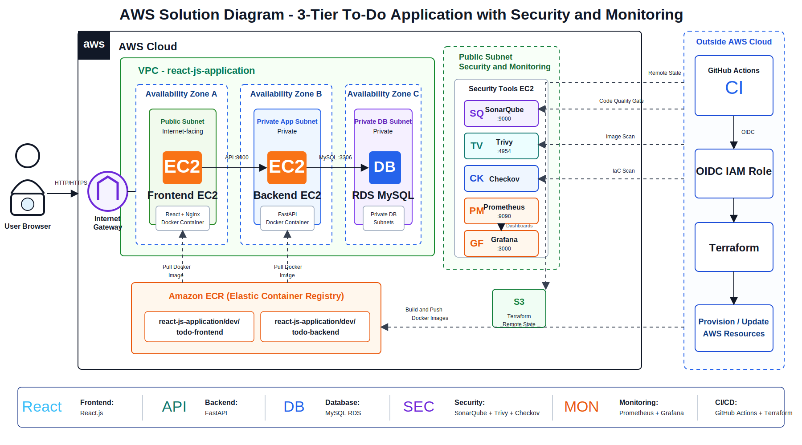
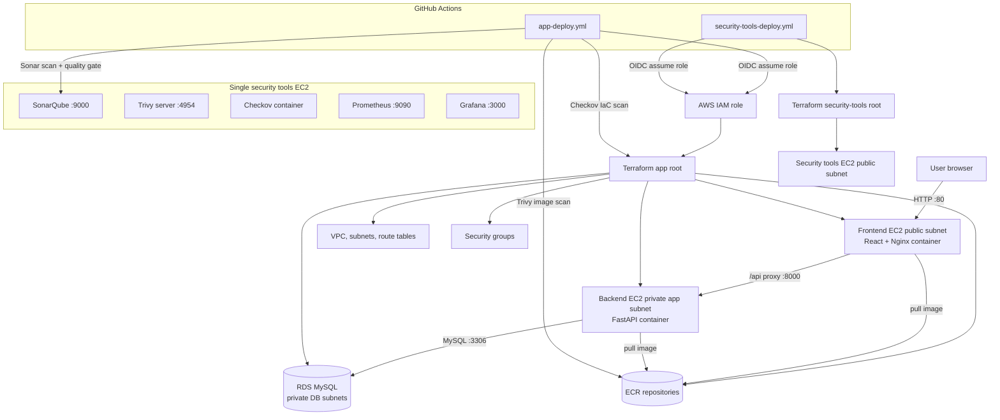
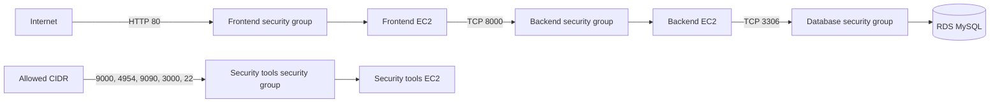
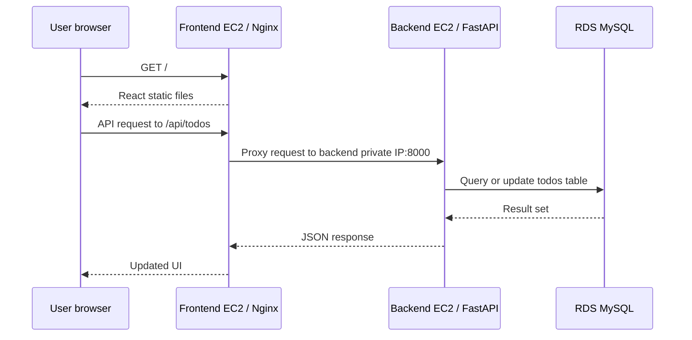
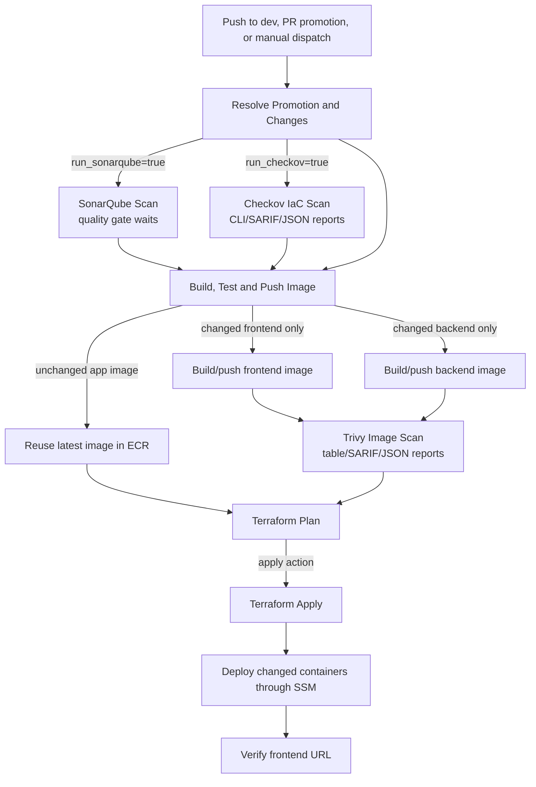
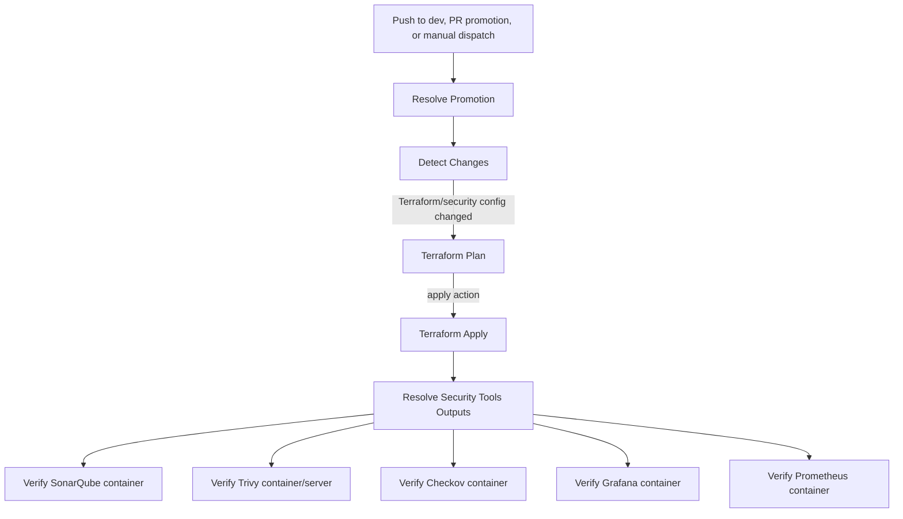
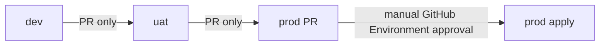

# React JS 3-Tier To-Do Application

This repository deploys a Dockerized 3-tier To-Do application on AWS with Terraform and GitHub Actions. It also includes a separate security tools stack that runs SonarQube, Trivy, Checkov, Prometheus, and Grafana as containers on a single EC2 instance.

## Current Project

```text
project_name = react-js-application
default_region = us-east-1
```

The application has three runtime tiers:

| Tier | Technology | AWS placement |
|---|---|---|
| Frontend | React + Nginx container | Public EC2 instance |
| Backend | FastAPI + Uvicorn container | Private EC2 instance |
| Database | MySQL | Private Amazon RDS subnet group |

The security and monitoring stack is separate from the app infrastructure:

| Tool | Purpose | Port |
|---|---|---:|
| SonarQube | Code quality scan and quality gate | 9000 |
| Trivy | Container image vulnerability scanning | 4954 |
| Checkov | Terraform IaC scanning | container CLI |
| Prometheus | Metrics collection | 9090 |
| Grafana | Metrics dashboards | 3000 |

## Repository Layout

```text
.
|-- .github/
|   `-- workflows/
|       |-- app-deploy.yml
|       `-- security-tools-deploy.yml
|-- backend/
|   |-- Dockerfile
|   |-- main.py
|   `-- requirements.txt
|-- frontend/
|   |-- Dockerfile
|   |-- index.html
|   |-- nginx/default.conf.template
|   |-- package.json
|   `-- src/
|-- terraform/
|   |-- main.tf
|   |-- variables.tf
|   |-- outputs.tf
|   |-- versions.tf
|   |-- environments/
|   |   |-- dev.tfvars
|   |   |-- uat.tfvars
|   |   `-- prod.tfvars
|   |-- modules/
|   |   |-- compute/
|   |   |-- database/
|   |   |-- ecr/
|   |   |-- kms/
|   |   |-- network/
|   |   `-- security-groups/
|   |-- security-tools/
|   |   |-- deploy/
|   |   |-- grafana/
|   |   `-- prometheus/
|   `-- templates/
|       |-- user_data_backend.sh.tftpl
|       |-- user_data_frontend.sh.tftpl
|       `-- user_data_sonarqube.sh.tftpl
|-- sonar-project.properties
`-- README.md
```

## Architecture





## Network Flow



Important network rules:

| Source | Destination | Port | Purpose |
|---|---|---:|---|
| Internet | Frontend EC2 | 80 | Public application UI |
| Frontend security group | Backend EC2 | 8000 | API traffic |
| Backend security group | RDS MySQL | 3306 | Database traffic |
| Allowed admin CIDR | Security tools EC2 | 9000 | SonarQube |
| Allowed admin CIDR | Security tools EC2 | 4954 | Trivy server |
| Allowed admin CIDR | Security tools EC2 | 9090 | Prometheus |
| Allowed admin CIDR | Security tools EC2 | 3000 | Grafana |

## Application Request Flow



The backend exposes these endpoints inside the private tier:

```text
GET    /health
GET    /todos
POST   /todos
PUT    /todos/{todo_id}
DELETE /todos/{todo_id}
POST   /seed
```

The frontend Nginx container proxies browser calls from `/api/...` to the private backend.

## CI/CD Overview

There are two active workflows:

| Workflow | Scope | State key |
|---|---|---|
| `.github/workflows/app-deploy.yml` | Frontend, backend, ECR, VPC, RDS, app security groups | `react-js-application/<env>/app/terraform.tfstate` |
| `.github/workflows/security-tools-deploy.yml` | SonarQube, Trivy, Checkov, Prometheus, Grafana EC2 stack | `react-js-application/<env>/security-tools/sucurity.state` |

The app and security-tools states are intentionally separate. Changes to the security tools infrastructure do not trigger app infrastructure changes, and app changes do not recreate the security tools stack.

## App Deployment Workflow



### Change isolation

The app workflow uses direct `git diff --name-only` detection against the actual push or PR SHAs.

| Changed path | Result |
|---|---|
| `frontend/**` | Build and push frontend image only |
| `backend/**` | Build and push backend image only |
| `sonar-project.properties` | Run SonarQube scan only |
| `terraform/*.tf`, `terraform/modules/**`, app workflow | Run Terraform and Checkov |
| `terraform/environments/dev.tfvars` | Run only for dev environment |
| `terraform/environments/uat.tfvars` | Run only for uat environment |
| `terraform/environments/prod.tfvars` | Run only for prod environment |

Manual workflow dispatch can run plan or apply, but it does not force a new frontend or backend image build. If no image changed, the workflow resolves the latest available image tag from ECR.

### App workflow stages

| Stage | Purpose |
|---|---|
| Resolve Promotion and Changes | Validates branch promotion rules and computes build/scan flags |
| SonarQube Scan | Runs code quality scan and blocks on quality gate |
| Checkov IaC Scan | Scans Terraform, uploads artifact and SARIF, then enforces gate |
| Build, Test and Push Image | Resolves ECR repos, builds changed images, reuses latest unchanged images |
| Trivy Image Scan | Scans changed container images and uploads artifact and SARIF |
| Terraform Plan | Initializes app state and creates `app.tfplan` |
| Prod Approval | Requires GitHub Environment approval for prod apply |
| Terraform Apply | Applies the saved Terraform plan |
| Deploy App Containers | Restarts only changed containers through SSM |
| Verify App | Verifies the frontend URL after apply |

## Security Tools Workflow



Security tools are deployed as containers on one EC2 instance using:

```text
terraform/security-tools/deploy/main.tf
terraform/templates/user_data_sonarqube.sh.tftpl
```

Default images:

```text
sonarqube:community
aquasec/trivy:latest
bridgecrew/checkov:latest
prom/prometheus:latest
grafana/grafana-oss:latest
```

Prometheus configuration lives in:

```text
terraform/security-tools/prometheus/prometheus.yml
```

Grafana datasource provisioning lives in:

```text
terraform/security-tools/grafana/provisioning/datasources/prometheus.yml
```

## Promotion Rules



Allowed paths:

| Source | Target | Behavior |
|---|---|---|
| Push to `dev` | `dev` | Applies dev by default |
| PR from `dev` | `uat` | Plans UAT |
| Manual dispatch from `dev` | `uat` | Allows UAT plan/apply |
| PR from `uat` | `prod` | Plans prod |
| Manual dispatch from `uat` | `prod` | Applies prod after manual approval |

Blocked paths include:

```text
feature -> uat
feature -> prod
dev -> prod
prod -> uat
push directly deploying uat or prod
```

## Terraform State

The project uses one S3 bucket with separate state keys.

App state:

```text
react-js-application/dev/app/terraform.tfstate
react-js-application/uat/app/terraform.tfstate
react-js-application/prod/app/terraform.tfstate
```

Security tools state:

```text
react-js-application/dev/security-tools/sucurity.state
react-js-application/uat/security-tools/sucurity.state
react-js-application/prod/security-tools/sucurity.state
```

> Note: the current security-tools state file name is `sucurity.state` because that is what the workflow and Terraform backend are configured to use.

## Environment Configuration

Each app environment uses a tfvars file:

```text
terraform/environments/dev.tfvars
terraform/environments/uat.tfvars
terraform/environments/prod.tfvars
```

Example dev settings:

```hcl
aws_region   = "us-east-1"
project_name = "react-js-application"
environment  = "dev"

vpc_cidr = "10.0.0.0/16"
az_count = 2

public_subnet_cidrs      = ["10.0.1.0/24", "10.0.2.0/24"]
private_app_subnet_cidrs = ["10.0.11.0/24", "10.0.12.0/24"]
private_db_subnet_cidrs  = ["10.0.21.0/24", "10.0.22.0/24"]

frontend_instance_type = "t2.micro"
backend_instance_type  = "t2.micro"

frontend_image_tag = "latest"
backend_image_tag  = "latest"

db_name                = "todoapp"
db_username            = "todo_admin"
db_instance_class      = "db.t3.micro"
db_allocated_storage   = 20
db_deletion_protection = false
```

Security tools tfvars:

```text
terraform/security-tools/deploy/scurity-tools.tfvars
```

Example security tools settings:

```hcl
enable_sonarqube        = true
sonarqube_instance_type = "t3.large"

sonarqube_image = "sonarqube:community"
trivy_image     = "aquasec/trivy:latest"
checkov_image   = "bridgecrew/checkov:latest"
```

## GitHub Configuration

Repository variables:

| Variable | Purpose |
|---|---|
| `AWS_REGION` | AWS region, for example `us-east-1` |
| `PROJECT_NAME` | Project prefix, for example `react-js-application` |
| `BOOTSTRAP_ROLE_ARN` | IAM role assumed by GitHub Actions using OIDC |
| `TF_STATE_BUCKET` | S3 bucket for Terraform remote state |
| `TERRAFORM_VERSION` | Terraform version, default `1.9.0` |
| `SONAR_HOST_URL` | SonarQube URL, for example `http://<ip>:9000` |

Repository secrets:

| Secret | Purpose |
|---|---|
| `DB_PASSWORD` | RDS MySQL password and backend runtime password |
| `SONAR_TOKEN` | SonarQube token with Execute Analysis permission |

Workflow permissions used by app deployment:

```yaml
permissions:
  id-token: write
  contents: read
  security-events: write
```

`security-events: write` is required for SARIF upload to GitHub Code Scanning.

## SonarQube Configuration

Project configuration is stored in:

```text
sonar-project.properties
```

Current key:

```properties
sonar.projectName=react-js-application
sonar.projectKey=react-js-application
sonar.sources=frontend/src,backend
sonar.python.version=3.12
```

The app workflow runs:

```text
SonarSource/sonarqube-scan-action
sonar.qualitygate.wait=true
```

The SonarQube token must be able to analyze project key:

```text
react-js-application
```

If the project does not already exist, grant the token user global `Create Projects`, or create the project manually and grant `Execute Analysis`.

## Security Reports

### Checkov

Checkov scans Terraform and produces:

```text
checkov-reports/
```

Formats:

```text
cli
sarif
json
```

The workflow uploads:

| Upload | Destination |
|---|---|
| Checkov report artifact | GitHub Actions artifact |
| Checkov SARIF | GitHub Code Scanning |

The workflow first generates reports with `--soft-fail`, uploads the artifact and SARIF, then runs a separate Checkov gate that can fail the job.

The workflow skips `CKV2_AWS_11` for VPC flow logs by design:

```text
--skip-check CKV2_AWS_11
```

### Trivy

Trivy scans changed container images only.

Generated files:

```text
trivy-reports/backend-table.txt
trivy-reports/backend.json
trivy-reports/backend.sarif
trivy-reports/frontend-table.txt
trivy-reports/frontend.json
trivy-reports/frontend.sarif
```

Uploads:

| Upload | Destination |
|---|---|
| Trivy report artifact | GitHub Actions artifact |
| Backend SARIF | GitHub Code Scanning category `trivy-backend-image-<env>` |
| Frontend SARIF | GitHub Code Scanning category `trivy-frontend-image-<env>` |

Trivy fails the deployment when HIGH or CRITICAL vulnerabilities are found after reports have been uploaded.

## ECR Image Strategy

Repository naming:

```text
react-js-application/<environment>/todo-frontend
react-js-application/<environment>/todo-backend
```

Examples:

```text
react-js-application/dev/todo-frontend
react-js-application/dev/todo-backend
```

Images are tagged with the Git SHA. If no frontend or backend code changed, the workflow does not build a new image and instead resolves the latest available image tag in ECR.

## Terraform Outputs

App outputs:

```text
frontend_public_ip
frontend_instance_id
backend_instance_id
backend_private_ip
db_address
db_name
db_username
frontend_url
```

Security tools outputs:

```text
sonarqube_url
security_tools_public_ip
trivy_server_url
prometheus_url
grafana_url
```

## Local Development

Frontend:

```powershell
cd frontend
npm install
npm run dev
```

Backend:

```powershell
cd backend
python -m venv .venv
.\.venv\Scripts\Activate.ps1
pip install -r requirements.txt
$env:DB_HOST="<rds-or-local-mysql-host>"
$env:DB_USER="todo_admin"
$env:DB_PASSWORD="<password>"
$env:DB_NAME="todoapp"
uvicorn main:app --reload
```

Docker build examples:

```powershell
docker build -t todo-frontend frontend
docker build -t todo-backend backend
```

## Manual Terraform Commands

App init:

```bash
terraform -chdir=terraform init \
  -backend-config="bucket=${TF_STATE_BUCKET}" \
  -backend-config="key=react-js-application/dev/app/terraform.tfstate" \
  -backend-config="region=us-east-1" \
  -backend-config="encrypt=true"
```

App plan:

```bash
terraform -chdir=terraform plan \
  -var-file="environments/dev.tfvars" \
  -var="frontend_image_tag=latest" \
  -var="backend_image_tag=latest"
```

Security tools init:

```bash
terraform -chdir=terraform/security-tools/deploy init \
  -backend-config="bucket=${TF_STATE_BUCKET}" \
  -backend-config="key=react-js-application/dev/security-tools/sucurity.state" \
  -backend-config="region=us-east-1" \
  -backend-config="encrypt=true"
```

Security tools plan:

```bash
terraform -chdir=terraform/security-tools/deploy plan \
  -var-file="scurity-tools.tfvars"
```

## Verification

Application:

```bash
curl http://<frontend-public-ip>
curl http://<frontend-public-ip>/api/health
curl http://<frontend-public-ip>/api/todos
```

Backend from the backend EC2 instance:

```bash
curl http://localhost:8000/health
docker ps
docker logs todo-backend --tail 100
```

Security tools:

```bash
curl http://<security-tools-public-ip>:9000
curl http://<security-tools-public-ip>:4954/healthz
curl http://<security-tools-public-ip>:9090
curl http://<security-tools-public-ip>:3000
```

Containers on the security tools EC2 instance:

```bash
docker ps
docker logs sonarqube --tail 100
docker logs trivy --tail 100
docker logs prometheus --tail 100
docker logs grafana --tail 100
```

## Troubleshooting

### Frontend is reachable but API returns 502

Check whether the backend container is running:

```bash
docker ps --filter name=todo-backend
docker logs todo-backend --tail 100
curl http://localhost:8000/health
```

Confirm the frontend can reach the backend private IP on port `8000`.

### Frontend public IP times out

Check the frontend instance and container:

```bash
docker ps --filter name=todo-frontend
docker logs todo-frontend --tail 100
sudo tail -n 200 /var/log/cloud-init-output.log
```

Confirm the frontend security group allows inbound TCP `80`.

### Docker is missing on EC2

Check user-data logs:

```bash
sudo tail -n 200 /var/log/cloud-init-output.log
```

If SSM is available, rerun the container deploy stage from the workflow after user data completes.

### SonarQube scan is unauthorized

Confirm:

```text
SONAR_HOST_URL points to the current SonarQube instance
SONAR_TOKEN is valid
Project key is react-js-application
Token user has Execute Analysis on the project
```

### SARIF upload fails with duplicate category

Trivy uploads backend and frontend SARIF separately:

```text
trivy-backend-image-<env>
trivy-frontend-image-<env>
```

Do not upload multiple SARIF runs under the same category.

### Terraform wants to recreate EC2 without infrastructure changes

The compute module ignores AMI and user-data drift for existing instances. Container updates are handled through SSM and Docker rather than by replacing EC2 instances.

## Design Notes

| Area | Decision |
|---|---|
| State separation | App and security tools use different backend state keys |
| Promotion | Only `dev -> uat` and `uat -> prod` are allowed |
| Production safety | Prod apply requires manual GitHub Environment approval |
| Image builds | Only changed frontend/backend paths build new images |
| Container deployment | Changed app containers are restarted through SSM |
| Security reporting | Checkov and Trivy upload artifacts and SARIF |
| Monitoring | Prometheus and Grafana run on the security tools EC2 instance |
| Public access | Frontend and security tools are public lab endpoints controlled by security groups |

## Final Checklist

Before running the workflows, confirm:

```text
GitHub variables are configured
GitHub secrets DB_PASSWORD and SONAR_TOKEN exist
GitHub Environment prod has required reviewers
AWS OIDC role trust policy allows this repository
Terraform state bucket exists
ECR repositories exist or Terraform can create/import them
SonarQube project key react-js-application exists or token can create projects
dev.tfvars, uat.tfvars, and prod.tfvars exist under terraform/environments
security tools tfvars file exists at terraform/security-tools/deploy/scurity-tools.tfvars
```
