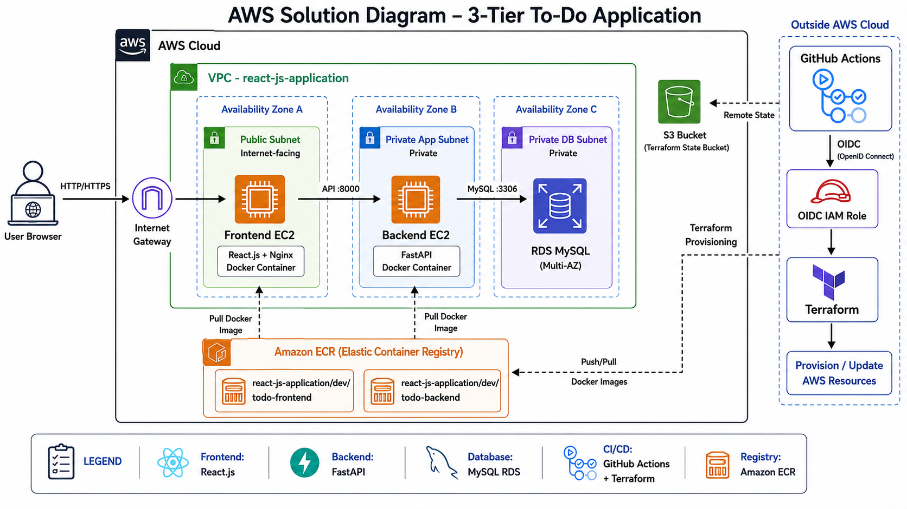

# Combined README Package

This package combines:

1. The detailed README architecture documentation
2. The AWS solution diagram section
3. The AWS solution diagram image asset

Copy these into the root of your repository:

```text
README.md
assets/aws_3_tier_to_do_app_architecture.png
```

The README references the image using:

```markdown

```
