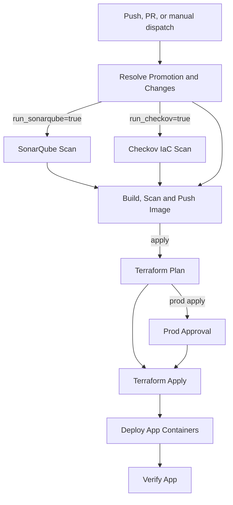

# App Deploy Workflow

This document explains the application deployment workflow in `.github/workflows/app-deploy.yml`.

The workflow deploys the 3-tier To-Do application:

| Tier | Runtime | AWS target |
|---|---|---|
| Frontend | React app served by Nginx container | Public EC2 instance |
| Backend | FastAPI container | Private EC2 instance |
| Database | MySQL | Private RDS subnet group |

It also includes DevSecOps checks before deployment:

| Tool | Purpose |
|---|---|
| SonarQube | Code quality scan and quality gate |
| Checkov | Terraform IaC security scan |
| Trivy | Pre-push Docker image vulnerability scan |

## Workflow Triggers

| Event | Branch or target | Default action | Purpose |
|---|---|---|---|
| `push` | `dev` only | `apply` | Deploy normal development changes to dev |
| `pull_request` | `uat` or `prod` | `plan` | Validate promotion changes before merge |
| `workflow_dispatch` | `dev`, `uat`, or `prod` | `plan` or `apply` | Manual controlled execution |

Push deployments are intentionally limited to `dev`. UAT and production are handled as promotions.

## Promotion Rules

| Target environment | Allowed source | Deployment behavior |
|---|---|---|
| `dev` | `dev` branch | Can run automatically on push |
| `uat` | `dev` branch | PR validation or manual dispatch from `dev` |
| `prod` | `uat` branch | Manual apply from `uat` only |

Production deploys use the GitHub `prod` environment, so they require manual approval before the deployment continues.

## Required GitHub Configuration

Repository or environment variables:

| Variable | Description |
|---|---|
| `AWS_REGION` | AWS region for Terraform, ECR, EC2, SSM, and RDS |
| `PROJECT_NAME` | Project name used in state keys, ECR repository paths, and resource naming |
| `BOOTSTRAP_ROLE_ARN` | IAM role assumed by GitHub Actions through OIDC |
| `TF_STATE_BUCKET` | S3 bucket used for Terraform remote state |
| `TERRAFORM_VERSION` | Terraform version; defaults to `1.9.0` when unset |
| `SONAR_HOST_URL` | SonarQube server URL |

Secrets:

| Secret | Description |
|---|---|
| `DB_PASSWORD` | Database password passed to Terraform as `TF_VAR_db_password` |
| `SONAR_TOKEN` | Token used by the SonarQube scan and report export steps |

Workflow permissions:

```yaml
permissions:
  id-token: write
  contents: read
  security-events: write
```

`id-token: write` allows GitHub Actions to assume the AWS IAM role through OIDC. `security-events: write` allows Checkov and Trivy SARIF reports to be uploaded to GitHub code scanning.

## Terraform State

The workflow stores application infrastructure state separately for each environment:

| Environment | State key | Variables file |
|---|---|---|
| `dev` | `${PROJECT_NAME}/dev/app/terraform.tfstate` | `terraform/environments/dev.tfvars` |
| `uat` | `${PROJECT_NAME}/uat/app/terraform.tfstate` | `terraform/environments/uat.tfvars` |
| `prod` | `${PROJECT_NAME}/prod/app/terraform.tfstate` | `terraform/environments/prod.tfvars` |

This prevents one environment from modifying another environment's state.

## Workflow Stages



## Stage Details

### Resolve Promotion and Changes

This is the first job. It decides what the workflow is allowed to do.

It resolves:

| Output | Meaning |
|---|---|
| `action` | `plan` or `apply` |
| `target_environment` | `dev`, `uat`, or `prod` |
| `state_key` | Terraform backend state key |
| `tfvars_file` | Environment-specific tfvars file |
| `run_environment` | Whether this environment should run at all |
| `build_frontend` | Whether the frontend image should be built |
| `build_backend` | Whether the backend image should be built |
| `run_sonarqube` | Whether SonarQube should run |
| `run_checkov` | Whether Checkov should run |

It uses `git diff --name-only` to detect changed files for push and pull request events.

### SonarQube Scan

This job runs when application code or `sonar-project.properties` changes.

It validates:

| Input | Purpose |
|---|---|
| `SONAR_HOST_URL` | Confirms the SonarQube server is reachable |
| `SONAR_TOKEN` | Confirms the workflow can authenticate to SonarQube |
| `PROJECT_NAME` | Used as the SonarQube project key |

The job runs `SonarSource/sonarqube-scan-action@v5` and waits for the quality gate. If the quality gate fails, the app deployment stops.

It uploads the `sonarqube-reports` artifact when report files are available.

### Checkov IaC Scan

This job scans Terraform code before deployment.

It produces:

| Output | Purpose |
|---|---|
| CLI report | Human-readable job output |
| JSON report | Machine-readable report artifact |
| SARIF report | GitHub code scanning integration |

The report artifact is uploaded as:

```text
checkov-iac-report-<environment>
```

The SARIF file is uploaded to GitHub code scanning with an environment-specific category.

### Prod Approval

This job runs only when:

```text
target_environment = prod
action = apply
```

It uses the GitHub `prod` environment. Configure required reviewers on that environment in GitHub so production deploys cannot continue without approval.

### Build, Scan and Push Image

This job runs only for `apply` actions after the required scan jobs pass.

It does four things:

1. Resolves the existing ECR repositories.
2. Builds only changed Docker images.
3. Scans changed images locally with Trivy before pushing.
4. Pushes only images that pass the Trivy gate.

If the frontend did not change, it reuses the latest existing frontend image from ECR. If the backend did not change, it reuses the latest existing backend image from ECR.

This prevents unnecessary image builds and avoids changing infrastructure when no relevant code or configuration changed.

Trivy reports are uploaded as:

```text
trivy-image-report-<environment>
```

Frontend and backend SARIF files are uploaded separately so GitHub code scanning does not reject duplicate categories.

### Terraform Plan

This job initializes Terraform using the environment-specific backend:

```bash
terraform init \
  -backend-config="bucket=${TF_STATE_BUCKET}" \
  -backend-config="key=${STATE_KEY}" \
  -backend-config="region=${AWS_REGION}" \
  -backend-config="encrypt=true"
```

It then creates a saved plan:

```text
terraform/app.tfplan
```

The saved plan is uploaded as the `app-plan` artifact.

### Terraform Apply

This job runs only when:

| Condition | Required value |
|---|---|
| Action | `apply` |
| Terraform plan | Successful |

It downloads the `app-plan` artifact and applies that exact plan:

```bash
terraform apply -auto-approve app.tfplan
```

Using the saved plan keeps the apply stage tied to the reviewed plan output.

### Deploy App Containers

This job runs only after a successful apply and only when either the frontend or backend image changed.

It uses AWS Systems Manager to connect to the EC2 instances and restart the affected containers.

Frontend deployment behavior:

| Item | Value |
|---|---|
| Host port | `80` |
| Container port | `8080` |
| Container | React app served by Nginx |

Backend deployment behavior:

| Item | Value |
|---|---|
| Host port | `8000` |
| Container port | `8000` |
| Container | FastAPI app |

### Verify App

This job runs after apply. It verifies that the frontend URL is reachable and that the real React app is being served.

It also rejects the temporary fallback page. If the frontend host is reachable but the app is not serving correctly, check:

```text
/var/log/user-data-frontend.log
```

## Change Isolation

The workflow is designed so unrelated changes do not trigger unrelated work.

| Changed path | Expected behavior |
|---|---|
| `frontend/**` | Build, scan, push, deploy, and verify frontend only |
| `backend/**` | Build, scan, push, deploy, and verify backend only |
| `frontend/**` and `backend/**` | Build, scan, push, deploy, and verify both images |
| `sonar-project.properties` | Run SonarQube scan without forcing a Docker build |
| `terraform/*.tf` | Run Checkov and Terraform |
| `terraform/modules/**` | Run Checkov and Terraform |
| `terraform/templates/user_data_frontend.sh.tftpl` | Treat as frontend deployment configuration |
| `terraform/templates/user_data_backend.sh.tftpl` | Treat as backend deployment configuration |
| `terraform/environments/dev.tfvars` | Affect dev only |
| `terraform/environments/uat.tfvars` | Affect uat only |
| `terraform/environments/prod.tfvars` | Affect prod only |

Manual dispatch does not automatically build new images. If no application image changed, the workflow reuses the latest image already pushed to ECR.

## Deployment Gates

| Gate | Blocks deployment when |
|---|---|
| Promotion validation | Source and target branches do not match the allowed path |
| SonarQube | Quality gate fails or token is not authorized |
| Checkov | Terraform violates enforced policies |
| Trivy | A changed image contains blocking findings |
| Prod approval | Manual approval has not been granted |
| Terraform plan | Terraform cannot create a valid plan |
| Terraform apply | Saved plan cannot be applied |
| App verification | Frontend URL is not reachable or serves the fallback page |

## Artifacts

| Artifact | Contents |
|---|---|
| `sonarqube-reports` | SonarQube issues, measures, quality gate, scanner task, and CE task details |
| `checkov-iac-report-<environment>` | Checkov CLI, SARIF, and JSON reports |
| `trivy-image-report-<environment>` | Trivy table, JSON, and SARIF reports |
| `app-plan` | Saved Terraform plan consumed by the apply job |

## Common Troubleshooting

| Error or symptom | Likely cause | What to check |
|---|---|---|
| SonarQube returns `403` | Token cannot browse, create, or analyze the project | `SONAR_TOKEN` permissions and SonarQube project key |
| SonarQube quality gate fails | Code quality policy failed | SonarQube dashboard and `sonarqube-reports` |
| Checkov fails | Terraform policy violation | `checkov-iac-report-<environment>` and GitHub code scanning |
| Trivy blocks image push | High or critical image vulnerability | `trivy-image-report-<environment>` |
| ECR image is missing | No prior image exists for an unchanged component | ECR repository image tags |
| SSM command fails | Instance is not registered or role lacks SSM permissions | EC2 instance profile and SSM Managed Instance status |
| Frontend shows fallback page | App container did not start correctly | `/var/log/user-data-frontend.log` |
| Frontend API returns `502` | Backend is unhealthy or unreachable from frontend | Backend container logs and backend security group rules |

## Normal Usage

For dev:

1. Push changes to the `dev` branch.
2. The workflow runs with `apply`.
3. Only changed components are built, scanned, pushed, and redeployed.

For UAT:

1. Open a pull request from `dev` to `uat`.
2. The workflow validates with `plan`.
3. Use manual dispatch from `dev` for an approved UAT apply when needed.

For production:

1. Open a pull request from `uat` to `prod`.
2. The workflow validates with `plan`.
3. Run manual dispatch from `uat` with `target_environment=prod` and `action=apply`.
4. Approve the GitHub `prod` environment gate.
