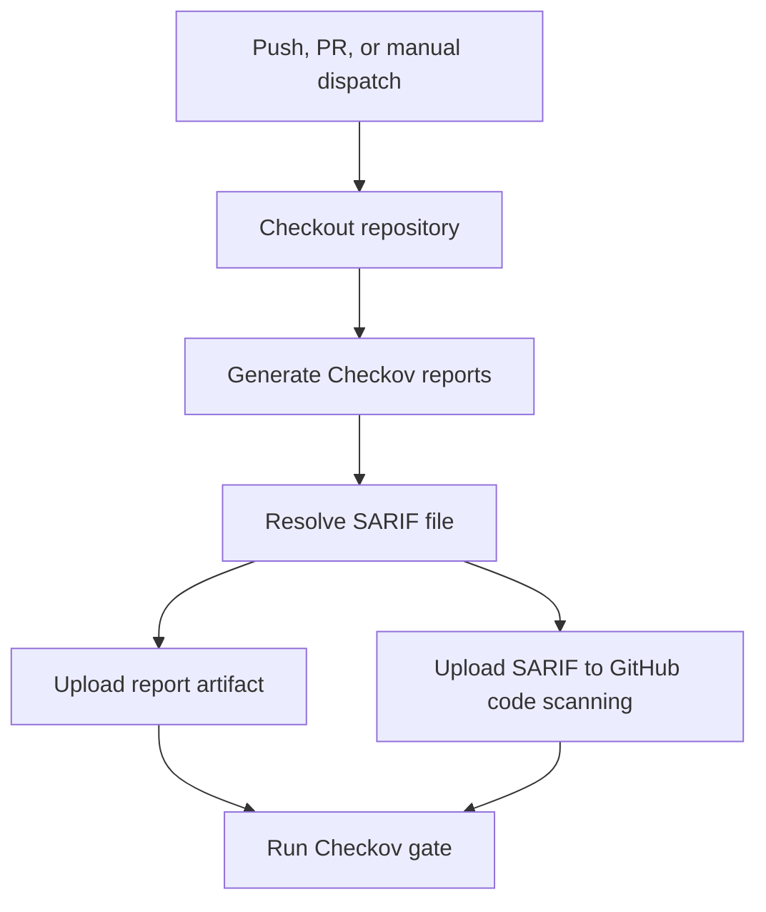

# Checkov Workflow

This document explains the standalone Checkov workflow in `.github/workflows/checkov.yml`.

The workflow scans infrastructure and configuration code using Checkov. It is separate from the application deployment workflow so IaC security checks can run independently whenever Terraform, Checkov configuration, or the Checkov workflow changes.

## Purpose

The Checkov workflow validates security and compliance posture for repository infrastructure code.

It scans using the configuration in:

```text
.checkov.yml
```

The workflow produces:

| Output | Purpose |
|---|---|
| CLI report | Human-readable Checkov results |
| JSON report | Machine-readable result artifact |
| SARIF report | GitHub code scanning upload |
| Gate result | Final pass or fail status for the workflow |

## Workflow Triggers

The workflow runs on these events:

| Event | Branch or target | Changed paths |
|---|---|---|
| `push` | `dev` | `.checkov.yml`, `.github/workflows/checkov.yml`, `terraform/**` |
| `pull_request` | `uat` or `prod` | `.checkov.yml`, `.github/workflows/checkov.yml`, `terraform/**` |
| `workflow_dispatch` | Manual | No path filter |

Push events run only on the `dev` branch. Pull request events run only when the promotion target is `uat` or `prod`.

## Permissions

The workflow uses these GitHub permissions:

```yaml
permissions:
  contents: read
  security-events: write
```

| Permission | Purpose |
|---|---|
| `contents: read` | Allows the workflow to check out repository code |
| `security-events: write` | Allows the workflow to upload SARIF results to GitHub code scanning |

## Concurrency

The workflow uses this concurrency group:

```yaml
concurrency:
  group: checkov-${{ github.workflow }}-${{ github.ref }}
  cancel-in-progress: true
```

This means a newer Checkov run on the same branch or pull request cancels an older in-progress Checkov run.

## Checkov Configuration

The workflow loads Checkov settings from `.checkov.yml`.

Current frameworks:

| Framework | Purpose |
|---|---|
| `terraform` | Scan Terraform infrastructure code |
| `dockerfile` | Scan Dockerfile configuration |
| `github_actions` | Scan GitHub Actions workflow configuration |
| `secrets` | Detect committed secrets |

Current scan directory:

```yaml
directory:
  - .
```

The scan starts at the repository root.

External modules and variables:

```yaml
download-external-modules: true
evaluate-variables: true
```

| Setting | Meaning |
|---|---|
| `download-external-modules` | Allows Checkov to inspect external Terraform modules |
| `evaluate-variables` | Allows Checkov to evaluate Terraform variables where possible |

Skipped paths:

| Path | Reason |
|---|---|
| `.terraform` | Terraform cache directory |
| `node_modules` | Dependency folder with large third-party code |
| `frontend` | Application source excluded from this IaC-focused Checkov scan |
| `backend` | Application source excluded from this IaC-focused Checkov scan |
| `**/examples/**` | Example code excluded |
| `**/test/**` | Test fixtures excluded |

Skipped checks:

| Check ID | Reason |
|---|---|
| `CKV2_AWS_11` | VPC flow logging requirement is intentionally suppressed |
| `CKV_GHA_7` | GitHub Actions SHA pinning requirement is intentionally suppressed |

## Workflow Stages



## Stage Details

### Checkout Repository

The workflow uses:

```yaml
actions/checkout@v4
```

This makes the repository available to the Checkov Docker container.

### Generate Checkov Reports

The workflow creates a local report folder:

```bash
mkdir -p checkov-reports
```

It then runs Checkov in Docker:

```bash
docker run --rm \
  -v "${PWD}:/repo" \
  -w /repo \
  bridgecrew/checkov:latest \
  --config-file /repo/.checkov.yml \
  -o cli \
  -o sarif \
  -o json \
  --output-file-path /repo/checkov-reports \
  --soft-fail
```

This first Checkov execution is report-focused. It uses `--soft-fail` so reports are still generated and uploaded even when Checkov finds failures.

Generated reports are written under:

```text
checkov-reports/
```

### Resolve Checkov SARIF

The workflow searches for a SARIF file:

```bash
find checkov-reports -type f \( -name '*.sarif' -o -name '*.sarif.json' \)
```

If no SARIF file is found, the workflow logs a warning but continues to upload any available artifact files.

### Upload Checkov Report Artifact

The workflow uploads the full report folder as a GitHub Actions artifact:

```text
checkov-iac-report
```

This artifact should contain the CLI, JSON, and SARIF outputs generated by Checkov.

### Upload Checkov SARIF

If a SARIF file exists, the workflow uploads it to GitHub code scanning using:

```yaml
github/codeql-action/upload-sarif@v4
```

The SARIF category is:

```text
checkov-iac
```

This makes Checkov findings visible in the repository Security tab under code scanning alerts.

### Run Checkov Gate

After reports are uploaded, the workflow runs Checkov again without `--soft-fail`:

```bash
docker run --rm \
  -v "${PWD}:/repo" \
  -w /repo \
  bridgecrew/checkov:latest \
  --config-file /repo/.checkov.yml
```

This is the enforcement step. If Checkov finds a failing check that is not skipped or suppressed, the job fails.

## Why Checkov Runs Twice

The workflow intentionally runs Checkov twice:

| Run | Behavior | Reason |
|---|---|---|
| Report run | Uses `--soft-fail` | Ensures reports and SARIF are uploaded even when findings exist |
| Gate run | No `--soft-fail` | Enforces the security gate and fails the workflow when needed |

This pattern avoids losing scan artifacts when the security gate fails.

## Reports

| Report type | Location | Use |
|---|---|---|
| CLI | `checkov-reports/` | Human-readable review |
| JSON | `checkov-reports/` | Automation and audit evidence |
| SARIF | `checkov-reports/` | GitHub code scanning |

The workflow artifact name is:

```text
checkov-iac-report
```

## Failure Behavior

| Failure | Meaning | What to check |
|---|---|---|
| Report generation fails | Checkov could not complete the report run | Docker availability, `.checkov.yml`, repo paths |
| SARIF upload skipped | No SARIF file was found | `checkov-reports/` artifact |
| SARIF upload fails | GitHub code scanning rejected the SARIF | `security-events: write` permission and SARIF category |
| Gate fails | Checkov found blocking policy violations | CLI output and `checkov-iac-report` artifact |

## Common Commands

Run the same Checkov scan locally from the repository root:

```bash
docker run --rm \
  -v "${PWD}:/repo" \
  -w /repo \
  bridgecrew/checkov:latest \
  --config-file /repo/.checkov.yml
```

Generate local reports without failing immediately:

```bash
docker run --rm \
  -v "${PWD}:/repo" \
  -w /repo \
  bridgecrew/checkov:latest \
  --config-file /repo/.checkov.yml \
  -o cli \
  -o sarif \
  -o json \
  --output-file-path /repo/checkov-reports \
  --soft-fail
```

Run only a specific Checkov check:

```bash
docker run --rm \
  -v "${PWD}:/repo" \
  -w /repo \
  bridgecrew/checkov:latest \
  --config-file /repo/.checkov.yml \
  --check CKV_DOCKER_7
```

Skip a specific Checkov check temporarily:

```bash
docker run --rm \
  -v "${PWD}:/repo" \
  -w /repo \
  bridgecrew/checkov:latest \
  --config-file /repo/.checkov.yml \
  --skip-check CKV_DOCKER_7
```

## Best Practices

Keep `.checkov.yml` as the single source of truth for Checkov behavior. Add skips only when there is a clear reason, and document why the check is suppressed.

Review both the GitHub code scanning alerts and the uploaded `checkov-iac-report` artifact. SARIF is useful for issue tracking, while the full artifact is better for audit evidence and debugging.

Avoid adding application dependency folders to the Checkov scan unless needed. Large third-party folders such as `node_modules` can make scans noisy and slow.
