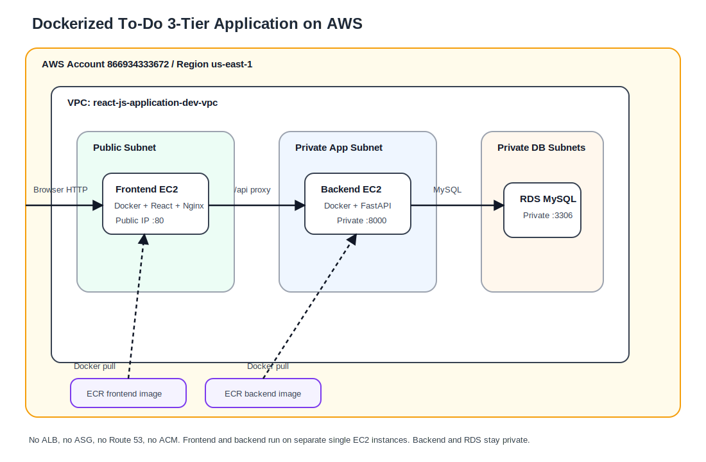
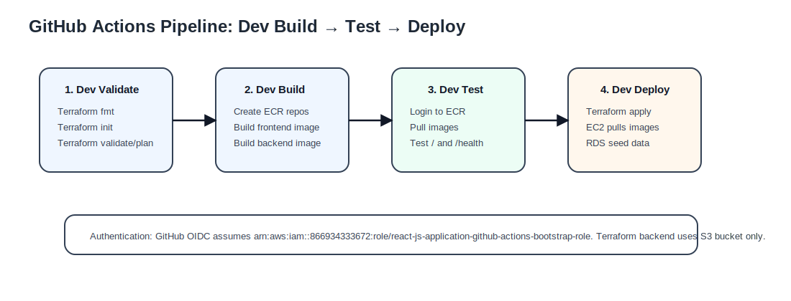
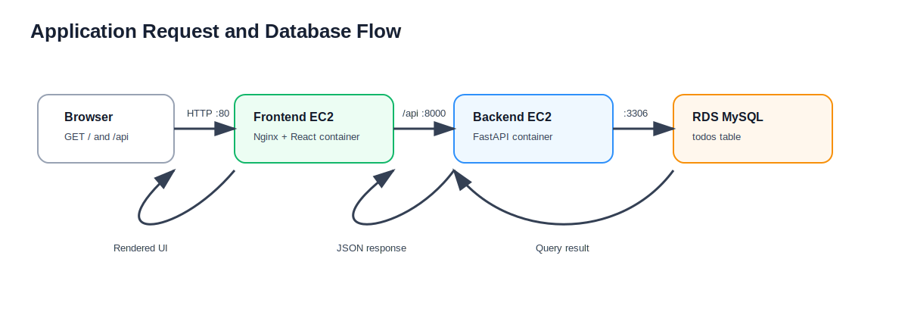

# Architecture and Flow Documentation

## 1. High-Level Architecture



```text
GitHub Actions -> AWS OIDC role -> ECR + Terraform
Terraform -> VPC + Subnets + SGs + EC2 + RDS
Browser -> Public Frontend EC2 -> Private Backend EC2 -> Private RDS MySQL
```

## 2. Deployment Flow



```text
Push to dev
  -> Dev Validate
  -> Dev Build Docker Images
  -> Dev Test Containers
  -> Dev Deploy Terraform
```

## 3. Request Flow



```text
Browser
  -> Frontend EC2 Public IP :80
  -> Nginx React container
  -> /api reverse proxy
  -> Backend EC2 Private IP :8000
  -> FastAPI container
  -> RDS MySQL :3306
```

## 4. Terraform Structure

```text
terraform/
├── main.tf
├── variables.tf
├── outputs.tf
├── versions.tf
├── terraform.tfvars.example
├── backend-values.example.txt
├── modules/
│   ├── network/
│   ├── security-groups/
│   ├── ecr/
│   ├── compute/
│   └── database/
└── templates/
    ├── user_data_frontend.sh.tftpl
    └── user_data_backend.sh.tftpl
```

## 5. Terraform Module Flow

```text
network -> security-groups -> ecr -> database -> compute
```

The `compute` module depends on outputs from the other modules because the EC2 instances need subnet IDs, security groups, Docker image URIs, and the RDS endpoint.
