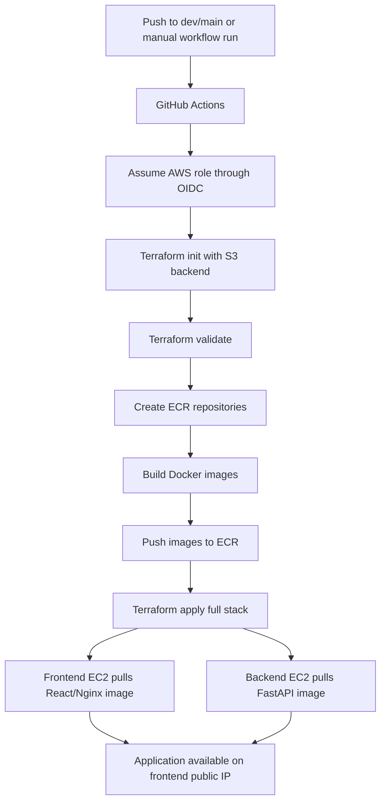
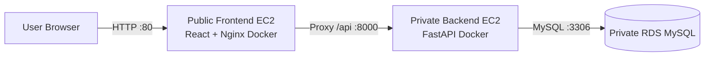
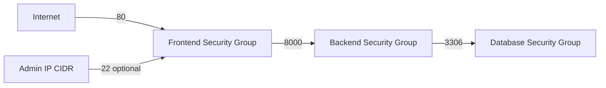

# Architecture and Flow Diagrams

This document provides the architecture, deployment, and request flows for the Dockerized To-Do 3-tier AWS application.

## Architecture Diagram

## Deployment Flow

## Application Request Flow

## Security Group Flow

## Network Placement

| Component | Placement | Public IP | Main inbound access |
|---|---|---:|---|
| Frontend EC2 | Public subnet | Yes | Internet on port 80 |
| Backend EC2 | Private app subnet | No | Frontend SG on port 8000 |
| RDS MySQL | Private DB subnets | No | Backend SG on port 3306 |
| NAT Gateway | Public subnet | Yes | Outbound path for private EC2 |
| ECR | AWS regional service | N/A | Image pull/push through AWS APIs |

## Excluded Services

This simplified deployment intentionally excludes ALB, ASG, Route 53, ACM, Cognito, Kubernetes, app-created KMS, and DynamoDB backend locking.
