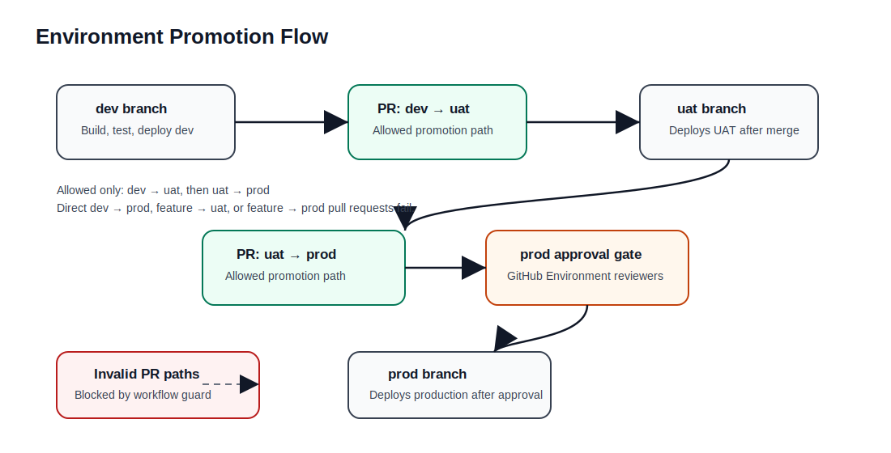

# Architecture and Flow Documentation

## 1. High-Level Architecture


```text
GitHub Actions -> AWS OIDC role -> ECR + Terraform
Terraform -> VPC + Subnets + SGs + EC2 + RDS
Browser -> Public Frontend EC2 -> Private Backend EC2 -> Private RDS MySQL
```

## 2. Deployment Flow


```text
Push to dev
  -> Dev Validate
  -> Dev Build Docker Images
  -> Dev Test Containers
  -> Dev Deploy Terraform
```

## 3. Request Flow


```text
Browser
  -> Frontend EC2 Public IP :80
  -> Nginx React container
  -> /api reverse proxy
  -> Backend EC2 Private IP :8000
  -> FastAPI container
  -> RDS MySQL :3306
```

## 4. Terraform Structure

```text
terraform/
├── main.tf
├── variables.tf
├── outputs.tf
├── versions.tf
├── terraform.tfvars.example
├── backend-values.example.txt
├── modules/
│   ├── network/
│   ├── security-tools/
│   ├── ecr/
│   ├── compute/
│   └── database/
└── templates/
    ├── user_data_frontend.sh.tftpl
    └── user_data_backend.sh.tftpl
```

## 5. Terraform Module Flow

```text
network -> security-groups -> ecr -> database -> compute
```

The `compute` module depends on outputs from the other modules because the EC2 instances need subnet IDs, security groups, Docker image URIs, and the RDS endpoint.


## Terraform environment structure

```text
terraform/environments/dev.tfvars   -> dev VPC, subnets, EC2, RDS, and ECR paths
terraform/environments/uat.tfvars   -> uat VPC, subnets, EC2, RDS, and ECR paths
terraform/environments/prod.tfvars  -> prod VPC, subnets, EC2, RDS, and ECR paths
```

Each environment uses the same reusable modules but a different `.tfvars` file. This allows the same code to deploy separate infrastructure stacks for dev, uat, and prod.


## Promotion Flow

```text
dev -> uat -> prod
```

Only these pull request paths are allowed by the workflow:

```text
dev -> uat
uat -> prod
```

Production deployment is protected by the GitHub Environment named `prod`. Configure required reviewers on that environment to create the approval gate before production Terraform apply runs.




## Separate workload sizing

The compute layer supports separate EC2 instance types for the frontend and backend workloads:

```hcl
frontend_instance_type = "t3.micro"
backend_instance_type  = "t3.small"
```

Use this when the backend API needs more CPU or memory than the frontend web container.
