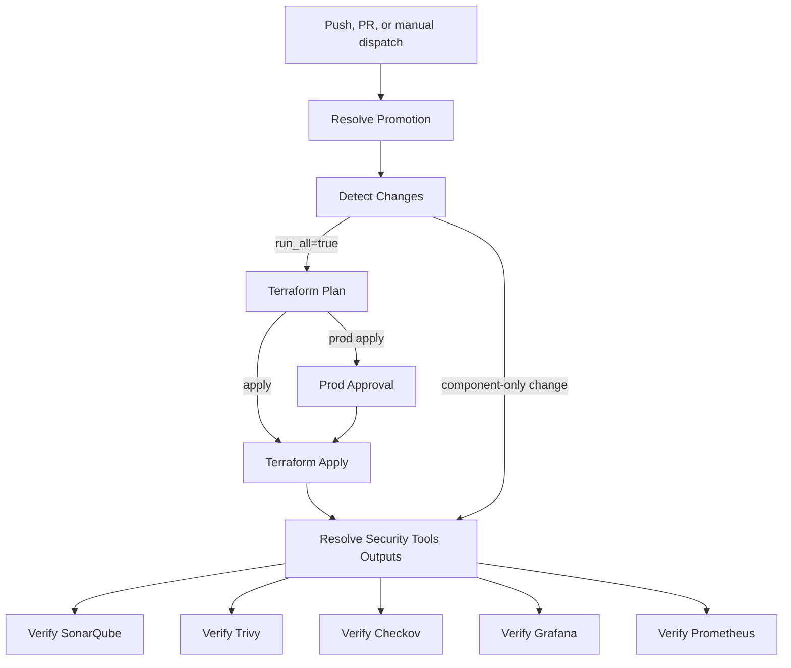

# Security Tools Deployment Workflow

This document explains the security tools deployment workflow in `.github/workflows/security-tools-deploy.yml`.

The workflow provisions and verifies the shared security and monitoring stack used by the project. The stack runs on a single EC2 instance and deploys the tools as Docker containers.

## Purpose

The workflow manages these security and monitoring components:

| Component | Image | Purpose | Port |
|---|---|---|---:|
| SonarQube | `sonarqube:community` | Code quality analysis and quality gate server | `9000` |
| Trivy | `aquasec/trivy:latest` | Vulnerability scanner server | `4954` |
| Checkov | `bridgecrew/checkov:latest` | IaC security scanner container | CLI container |
| Prometheus | `prom/prometheus:v2.55.1` | Metrics collection | `9090` |
| Grafana | `grafana/grafana-oss:11.4.0` | Metrics dashboards | `3000` |

The workflow is intentionally separate from the application deployment workflow. Security tools infrastructure uses its own Terraform root, its own tfvars file, and its own remote state key so app infrastructure changes do not recreate the security tools stack.

## Workflow Triggers

| Event | Branch or target | Changed paths |
|---|---|---|
| `push` | `dev` | Security tools Terraform, SonarQube/Grafana/Prometheus files, user data template, or workflow file |
| `pull_request` | `uat` or `prod` | Security tools Terraform, SonarQube/Grafana/Prometheus files, user data template, or workflow file |
| `workflow_dispatch` | Manual | User selects `plan` or `apply` and target environment |

Push deployments are limited to `dev`. UAT and production use controlled promotion paths.

## Promotion Rules

| Target environment | Allowed source | Action behavior |
|---|---|---|
| `dev` | `dev` branch | Push can run `apply`; manual dispatch can run from `dev` |
| `uat` | `dev` branch | PR from `dev` to `uat`, or manual dispatch from `dev` |
| `prod` | `uat` branch | PR from `uat` to `prod`, or manual `apply` from `uat` |

Production applies require the protected GitHub `prod` environment approval.

## Required GitHub Configuration

Repository or environment variables:

| Variable | Purpose |
|---|---|
| `AWS_REGION` | AWS region for Terraform, EC2, IAM, SSM, and networking lookups |
| `PROJECT_NAME` | Project name used in state keys, resource names, and tags |
| `BOOTSTRAP_ROLE_ARN` | IAM role assumed by GitHub Actions through OIDC |
| `TF_STATE_BUCKET` | S3 bucket used for Terraform remote state |
| `TERRAFORM_VERSION` | Terraform version; defaults to `1.9.0` |

Workflow-level image values:

| Variable | Value |
|---|---|
| `TRIVY_IMAGE` | `aquasec/trivy:latest` |
| `CHECKOV_IMAGE` | `bridgecrew/checkov:latest` |
| `SONARQUBE_IMAGE` | `sonarqube:community` |
| `PROMETHEUS_IMAGE` | `prom/prometheus:v2.55.1` |
| `GRAFANA_IMAGE` | `grafana/grafana-oss:11.4.0` |

Security tools Terraform files:

| Variable | Value |
|---|---|
| `TFVARS_FILE` | `scurity-tools.tfvars` |
| `USER_DATA_TEMPLATE_PATH` | `../../templates/user_data_sonarqube.sh.tftpl` |

Workflow permissions:

```yaml
permissions:
  id-token: write
  contents: read
```

`id-token: write` allows GitHub Actions to assume the AWS role through OIDC. `contents: read` allows repository checkout.

## Terraform State

The workflow uses a separate state file for the security tools stack:

```text
${PROJECT_NAME}/${ENVIRONMENT}/security-tools/sucurity.state
```

The Terraform working directory is:

```text
terraform/security-tools/deploy
```

The tfvars file is:

```text
terraform/security-tools/deploy/scurity-tools.tfvars
```

The state and tfvars names currently use `sucurity` and `scurity` spelling because that is what the workflow and repository are configured to use.

## Shared Network Discovery

The security tools EC2 instance is deployed into the existing application VPC.

During the plan stage, the workflow discovers:

| Resource | Lookup |
|---|---|
| VPC | Tag name `${PROJECT_NAME}-${ENVIRONMENT}-vpc` |
| Public subnet | Tag name `${PROJECT_NAME}-${ENVIRONMENT}-public-1` |

These values are passed into Terraform as:

```text
vpc_id
sonarqube_subnet_id
```

This keeps the security tools stack in the same AWS network while keeping its Terraform state separate from the app stack.

## Workflow Stages



## Stage Details

### Resolve Promotion

This job validates the event, source branch, target environment, and requested action.

It outputs:

| Output | Meaning |
|---|---|
| `action` | `plan` or `apply` |
| `target_environment` | `dev`, `uat`, or `prod` |
| `state_key` | Remote Terraform state key |

If the promotion path is invalid, the workflow stops immediately.

### Detect Changes

This job determines which parts of the security tools workflow need to run.

It detects changes in:

| Path | Flag |
|---|---|
| `terraform/security-tools/deploy/**` | `run_all=true` |
| `terraform/templates/user_data_sonarqube.sh.tftpl` | `run_all=true` |
| `.github/workflows/security-tools-deploy.yml` | `run_all=true` |
| `terraform/security-tools/sonarqube/**` | `run_sonarqube=true` |
| `terraform/security-tools/grafana/**` | `run_grafana=true` |
| `terraform/security-tools/prometheus/**` | `run_prometheus=true` |

Manual workflow dispatch sets `run_all=true`.

### Terraform Plan

This job runs only when `run_all=true`.

It performs:

1. Repository checkout.
2. AWS credential configuration through OIDC.
3. Terraform setup.
4. Terraform init with the security tools state key.
5. Terraform validate.
6. Verification that `scurity-tools.tfvars` exists.
7. Shared VPC and subnet discovery.
8. Import of existing resources when found.
9. Terraform plan.
10. Upload of the saved plan artifact.

The saved plan is uploaded as:

```text
security-tools-plan
```

### Import Existing Security Tools Resources

Before planning, the workflow tries to import existing resources into state if they already exist in AWS.

This helps avoid duplicate resource errors for resources such as:

| Resource | Example name pattern |
|---|---|
| IAM role | `${PROJECT_NAME}-${ENVIRONMENT}-sonarqube-ec2-role` |
| Instance profile | `${PROJECT_NAME}-${ENVIRONMENT}-sonarqube-instance-profile` |
| Security group | `${PROJECT_NAME}-${ENVIRONMENT}-sonarqube-sg` |
| EC2 instance | `${PROJECT_NAME}-${ENVIRONMENT}-sonarqube` |
| SSM role attachment | `AmazonSSMManagedInstanceCore` attachment |

If a resource is already managed in Terraform state, the workflow skips importing it.

### Prod Approval

This job runs only when:

```text
target_environment = prod
action = apply
run_all = true
```

It uses the GitHub `prod` environment for manual approval.

### Terraform Apply

This job runs only when:

| Condition | Required value |
|---|---|
| `run_all` | `true` |
| `action` | `apply` |
| Terraform plan | Successful |
| Production approval | Successful when target is `prod` |

It downloads the saved `security-tools-plan` artifact and applies it:

```bash
terraform apply -auto-approve security-tools.tfplan
```

### Resolve Security Tools Outputs

This job reads Terraform outputs after apply or during component-only verification.

It expects outputs such as:

| Output | Used by |
|---|---|
| `sonarqube_url` | SonarQube verification |
| `trivy_server_url` | Trivy endpoint verification |
| `grafana_url` | Grafana endpoint verification |
| `prometheus_url` | Prometheus endpoint verification |

It also resolves the running EC2 instance by tag:

```text
${PROJECT_NAME}-${ENVIRONMENT}-sonarqube
```

The resolved instance ID is used by later SSM verification jobs.

## Component Verification Jobs

The workflow verifies tools after infrastructure changes or component-specific changes.

### SonarQube

Runs when `run_sonarqube=true`.

It verifies:

1. The SonarQube endpoint is reachable.
2. The `sonarqube` Docker container is running.

The SSM command also prepares SonarQube host requirements:

| Setting | Value |
|---|---|
| `vm.max_map_count` | `524288` |
| `fs.file-max` | `131072` |
| Docker network | `security-tools` |
| Host path | `/opt/security-tools/sonarqube` |
| Port mapping | `9000:9000` |

### Trivy

Runs when `run_all=true`.

It verifies:

1. The `trivy` Docker container exists or creates it.
2. The container is running.
3. The local health endpoint works.
4. The external Trivy server endpoint works.

Trivy runs as a server on:

```text
0.0.0.0:4954
```

Health check path:

```text
/healthz
```

### Checkov

Runs when `run_all=true`.

It verifies:

1. The `checkov` container exists or creates it.
2. The container is running.
3. `checkov --version` works inside the container.

The container is kept alive with a shell command so it can be reused for verification.

### Grafana

Runs when `run_grafana=true`.

It verifies:

1. The Grafana HTTP health endpoint works.
2. The `grafana` Docker container is running.

Endpoint checked:

```text
/api/health
```

Port mapping:

```text
3000:3000
```

Grafana data is persisted under:

```text
/opt/security-tools/grafana/data
```

### Prometheus

Runs when `run_prometheus=true`.

It verifies:

1. The Prometheus readiness endpoint works.
2. The `prometheus` Docker container is running.

Endpoint checked:

```text
/-/ready
```

Port mapping:

```text
9090:9090
```

Prometheus data is persisted under:

```text
/opt/security-tools/prometheus/data
```

## Change Isolation

The workflow is designed so component-only changes do not force every stage to run.

| Change | Expected behavior |
|---|---|
| Security tools Terraform deploy files | Run full Terraform plan/apply and all required output resolution |
| User data template | Run full Terraform plan/apply |
| Workflow file | Run full Terraform plan/apply |
| SonarQube component files | Verify SonarQube only |
| Grafana component files | Verify Grafana only |
| Prometheus component files | Verify Prometheus only |
| Manual dispatch | Run full workflow |

Trivy and Checkov verification are tied to `run_all=true` because they are deployed as containers on the shared security tools EC2 instance rather than as separate component directories in the current change detection logic.

## Artifacts

| Artifact | Contents |
|---|---|
| `security-tools-plan` | Saved Terraform plan file from `terraform/security-tools/deploy/security-tools.tfplan` |

The workflow does not upload scan reports. It deploys and verifies the security tools platform. Checkov and Trivy scan report artifacts are handled by the separate `checkov.yml`, `trivy.yml`, and app deployment workflows.

## Common Troubleshooting

| Symptom | Likely cause | What to check |
|---|---|---|
| Missing `scurity-tools.tfvars` | File not present in `terraform/security-tools/deploy` | Confirm file name and path |
| No shared VPC found | App VPC does not exist for the target environment | VPC tag `${PROJECT_NAME}-${ENVIRONMENT}-vpc` |
| No public subnet found | Expected public subnet does not exist | Subnet tag `${PROJECT_NAME}-${ENVIRONMENT}-public-1` |
| Duplicate IAM role or security group | Existing AWS resource is not in Terraform state | Import step logs and Terraform state |
| No Terraform outputs found | Security tools stack has not been applied yet | Run full `apply` for the environment |
| No running security tools instance found | EC2 instance is stopped, terminated, or incorrectly tagged | EC2 tag `${PROJECT_NAME}-${ENVIRONMENT}-sonarqube` |
| SSM command fails | Instance not registered with SSM or role lacks permissions | Instance profile and SSM Managed Instance status |
| SonarQube does not start | Host kernel settings, memory, or container logs | SSM output and `docker logs sonarqube` |
| Trivy endpoint fails | Container not running or port `4954` blocked | Security group, container status, `/healthz` |
| Grafana endpoint fails | Container not running or port `3000` blocked | Security group and `/api/health` |
| Prometheus endpoint fails | Container not running or port `9090` blocked | Security group and `/-/ready` |

## Normal Usage

For dev:

1. Change security tools Terraform, templates, or component files.
2. Push to the `dev` branch.
3. The workflow validates promotion rules, detects scope, and applies dev changes when needed.

For UAT:

1. Open a pull request from `dev` to `uat`.
2. The workflow runs a plan for validation.
3. Use manual dispatch from `dev` with `target_environment=uat` and `action=apply` when ready.

For production:

1. Open a pull request from `uat` to `prod`.
2. The workflow runs a plan for validation.
3. Use manual dispatch from `uat` with `target_environment=prod` and `action=apply`.
4. Approve the GitHub `prod` environment gate.

## Local Terraform Commands

From the security tools Terraform directory:

```bash
cd terraform/security-tools/deploy
```

Initialize state for dev:

```bash
terraform init \
  -backend-config="bucket=<terraform-state-bucket>" \
  -backend-config="key=react-js-application/dev/security-tools/sucurity.state" \
  -backend-config="region=us-east-1" \
  -backend-config="encrypt=true"
```

Plan with explicit shared network values:

```bash
terraform plan \
  -var-file="scurity-tools.tfvars" \
  -var="aws_region=us-east-1" \
  -var="project_name=react-js-application" \
  -var="environment=dev" \
  -var="vpc_id=<vpc-id>" \
  -var="sonarqube_subnet_id=<public-subnet-id>" \
  -var="user_data_template_path=../../templates/user_data_sonarqube.sh.tftpl"
```

## Best Practices

Keep the security tools state separate from the app state. This prevents security tools changes from recreating frontend, backend, or database resources.

Use pinned images where possible for monitoring components. Prometheus and Grafana are pinned in this workflow, while SonarQube, Trivy, and Checkov can be pinned later if stricter reproducibility is required.

Use SSM for container verification instead of SSH. This keeps verification scriptable and avoids depending on direct SSH access from GitHub-hosted runners.

Keep production protected with the GitHub `prod` environment. That approval gate is the control point for UAT to production promotion.
