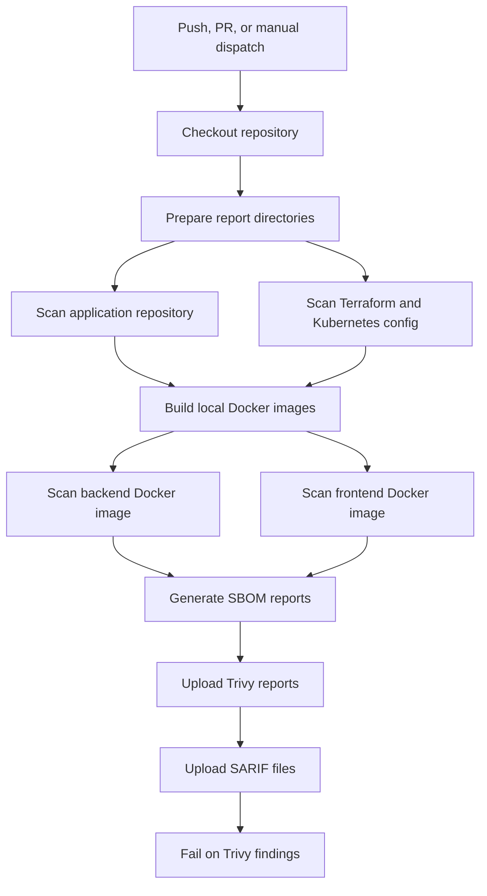

# Trivy Security Scan Workflow

This document explains the standalone Trivy workflow in `.github/workflows/trivy.yml`.

The workflow scans the repository, infrastructure configuration, Docker images, dependencies, secrets, licenses, and SBOM output using Trivy. It is separate from the application deployment workflow so security scanning can run independently whenever application, infrastructure, dependency, Dockerfile, or workflow files change.

## Purpose

The Trivy workflow provides broad security coverage for the repository.

It scans:

| Target | Trivy command | Purpose |
|---|---|---|
| Application repository | `trivy fs` | Vulnerabilities, secrets, and licenses in repository files |
| Terraform and Kubernetes configuration | `trivy config` | IaC and Kubernetes misconfiguration scanning |
| Backend Docker image | `trivy image` | Vulnerabilities, secrets, and licenses in the backend image |
| Frontend Docker image | `trivy image` | Vulnerabilities, secrets, and licenses in the frontend image |
| Repository SBOM | `trivy fs --format cyclonedx` | CycloneDX SBOM for repository content |
| Backend image SBOM | `trivy image --format cyclonedx` | CycloneDX SBOM for backend image |
| Frontend image SBOM | `trivy image --format cyclonedx` | CycloneDX SBOM for frontend image |

## Workflow Triggers

The workflow runs on these events:

| Event | Branch or target | Changed paths |
|---|---|---|
| `push` | `dev` | Trivy workflow, backend, frontend, Terraform, dependency locks, Dockerfiles, Terraform files, YAML, and JSON |
| `pull_request` | `uat` or `prod` | Trivy workflow, backend, frontend, Terraform, dependency locks, Dockerfiles, Terraform files, YAML, and JSON |
| `workflow_dispatch` | Manual | No path filter |

Push events run only on the `dev` branch. Pull request scans run for promotion targets `uat` and `prod`.

## Permissions

The workflow uses these GitHub permissions:

```yaml
permissions:
  contents: read
  security-events: write
```

| Permission | Purpose |
|---|---|
| `contents: read` | Allows checkout of repository code |
| `security-events: write` | Allows SARIF upload to GitHub code scanning |

## Concurrency

The workflow uses:

```yaml
concurrency:
  group: trivy-${{ github.workflow }}-${{ github.ref }}
  cancel-in-progress: true
```

This cancels older in-progress Trivy runs for the same branch or pull request when a newer run starts.

## Workflow Environment

The workflow defines these environment variables:

| Variable | Value | Purpose |
|---|---|---|
| `TRIVY_IMAGE` | `aquasec/trivy:latest` | Docker image used to run Trivy |
| `FRONTEND_IMAGE` | `react-js-application/todo-frontend:${{ github.sha }}` | Local frontend image tag built for scanning |
| `BACKEND_IMAGE` | `react-js-application/todo-backend:${{ github.sha }}` | Local backend image tag built for scanning |

The frontend and backend image tags use the Git commit SHA so each scan is tied to the exact source revision.

## Workflow Stages



## Stage Details

### Checkout Repository

The workflow checks out the repository using:

```yaml
actions/checkout@v4
```

This makes the application, Terraform, workflow, and dependency files available to Trivy.

### Prepare Report Directories

The workflow creates report folders:

```bash
mkdir -p trivy-reports/{repository,config,images,sbom}
```

| Directory | Contents |
|---|---|
| `trivy-reports/repository` | Repository filesystem scan reports |
| `trivy-reports/config` | Terraform and Kubernetes config scan reports |
| `trivy-reports/images` | Backend and frontend image scan reports |
| `trivy-reports/sbom` | CycloneDX SBOM reports |

### Scan Application Repository

The repository scan uses:

```bash
trivy fs /repo
```

It enables these scanners:

```text
vuln,secret,license
```

It filters to:

```text
HIGH,CRITICAL
```

It also uses:

```text
--ignore-unfixed
```

That means vulnerabilities without available fixes are ignored in this scan.

Generated files:

| File | Format |
|---|---|
| `trivy-reports/repository/repository-table.txt` | Table |
| `trivy-reports/repository/repository.json` | JSON |
| `trivy-reports/repository/repository.sarif` | SARIF |

### Scan Terraform and Kubernetes Configuration

The config scan uses:

```bash
trivy config /repo
```

It scans IaC and Kubernetes-style configuration for security misconfigurations.

Generated files:

| File | Format |
|---|---|
| `trivy-reports/config/config-table.txt` | Table |
| `trivy-reports/config/config.json` | JSON |
| `trivy-reports/config/config.sarif` | SARIF |

### Build Local Docker Images

Before image scanning, the workflow builds local images:

```bash
docker build -t "${BACKEND_IMAGE}" backend
docker build -t "${FRONTEND_IMAGE}" frontend
```

These images are built only for scanning in this standalone Trivy workflow. The workflow does not push these images to ECR.

In the application deployment workflow, images are also scanned before being pushed to ECR.

### Scan Backend Docker Image

The backend image scan uses:

```bash
trivy image "${BACKEND_IMAGE}"
```

It scans for:

```text
vuln,secret,license
```

Generated files:

| File | Format |
|---|---|
| `trivy-reports/images/backend-image-table.txt` | Table |
| `trivy-reports/images/backend-image.json` | JSON |
| `trivy-reports/images/backend-image.sarif` | SARIF |

### Scan Frontend Docker Image

The frontend image scan uses:

```bash
trivy image "${FRONTEND_IMAGE}"
```

It scans for:

```text
vuln,secret,license
```

Generated files:

| File | Format |
|---|---|
| `trivy-reports/images/frontend-image-table.txt` | Table |
| `trivy-reports/images/frontend-image.json` | JSON |
| `trivy-reports/images/frontend-image.sarif` | SARIF |

### Generate SBOM Reports

The workflow generates CycloneDX SBOM files for the repository and both local Docker images.

Generated SBOM files:

| File | Target |
|---|---|
| `trivy-reports/sbom/repository-cyclonedx.json` | Repository filesystem |
| `trivy-reports/sbom/backend-image-cyclonedx.json` | Backend Docker image |
| `trivy-reports/sbom/frontend-image-cyclonedx.json` | Frontend Docker image |

These files are uploaded with the Trivy artifact and can be used for audit, dependency review, and supply chain tracking.

### Upload Trivy Reports

The workflow uploads the full report directory as a GitHub Actions artifact:

```text
trivy-security-reports
```

This artifact includes:

| Report group | Contents |
|---|---|
| Repository | Table, JSON, SARIF |
| Config | Table, JSON, SARIF |
| Images | Backend and frontend table, JSON, SARIF |
| SBOM | Repository, backend image, and frontend image CycloneDX files |

The upload uses `if: always()`, so the reports are still uploaded even when findings exist.

### Upload SARIF Reports

The workflow uploads SARIF files separately to avoid duplicate SARIF categories.

| SARIF file | Category |
|---|---|
| `trivy-reports/repository/repository.sarif` | `trivy-repository` |
| `trivy-reports/config/config.sarif` | `trivy-config` |
| `trivy-reports/images/backend-image.sarif` | `trivy-backend-image` |
| `trivy-reports/images/frontend-image.sarif` | `trivy-frontend-image` |

Separate categories are important because GitHub code scanning rejects multiple SARIF runs with the same category.

### Fail on Trivy Findings

The final gate reads the JSON reports:

```text
trivy-reports/repository/repository.json
trivy-reports/config/config.json
trivy-reports/images/backend-image.json
trivy-reports/images/frontend-image.json
```

It counts:

| Finding type | Severity |
|---|---|
| Vulnerabilities | `HIGH` or `CRITICAL` |
| Misconfigurations | `HIGH` or `CRITICAL` |
| Secrets | `HIGH` or `CRITICAL` |

If the total count is greater than zero, the workflow fails after reports and SBOMs have already been uploaded.

## Why Scan Steps Use `continue-on-error`

The repository, config, backend image, and frontend image scan steps use `continue-on-error: true`.

This allows the workflow to keep going long enough to:

1. Generate all report formats.
2. Generate SBOM files.
3. Upload artifacts.
4. Upload SARIF files to GitHub code scanning.
5. Fail only at the final gate with a complete report set available.

## Reports

| Report | Location |
|---|---|
| Repository table | `trivy-reports/repository/repository-table.txt` |
| Repository JSON | `trivy-reports/repository/repository.json` |
| Repository SARIF | `trivy-reports/repository/repository.sarif` |
| Config table | `trivy-reports/config/config-table.txt` |
| Config JSON | `trivy-reports/config/config.json` |
| Config SARIF | `trivy-reports/config/config.sarif` |
| Backend image table | `trivy-reports/images/backend-image-table.txt` |
| Backend image JSON | `trivy-reports/images/backend-image.json` |
| Backend image SARIF | `trivy-reports/images/backend-image.sarif` |
| Frontend image table | `trivy-reports/images/frontend-image-table.txt` |
| Frontend image JSON | `trivy-reports/images/frontend-image.json` |
| Frontend image SARIF | `trivy-reports/images/frontend-image.sarif` |
| Repository SBOM | `trivy-reports/sbom/repository-cyclonedx.json` |
| Backend image SBOM | `trivy-reports/sbom/backend-image-cyclonedx.json` |
| Frontend image SBOM | `trivy-reports/sbom/frontend-image-cyclonedx.json` |

## Failure Behavior

| Failure | Meaning | What to check |
|---|---|---|
| Docker build fails | Frontend or backend image cannot be built | Dockerfile and application dependency files |
| SARIF upload fails | GitHub rejected the SARIF upload | `security-events: write` permission and SARIF category |
| Missing JSON report warning | One expected report file was not generated | `trivy-security-reports` artifact |
| Final gate fails | High or critical findings were detected | JSON reports and GitHub code scanning alerts |
| Trivy database download fails | Trivy could not fetch vulnerability data | Runner network access or Trivy registry availability |

## Local Commands

Run a repository filesystem scan:

```bash
docker run --rm \
  -v "${PWD}:/repo" \
  -v "${HOME}/.cache/trivy:/root/.cache/" \
  aquasec/trivy:latest fs /repo \
  --scanners vuln,secret,license \
  --severity HIGH,CRITICAL \
  --ignore-unfixed
```

Run a Terraform and Kubernetes config scan:

```bash
docker run --rm \
  -v "${PWD}:/repo" \
  -v "${HOME}/.cache/trivy:/root/.cache/" \
  aquasec/trivy:latest config /repo \
  --severity HIGH,CRITICAL
```

Build and scan the backend image:

```bash
docker build -t react-js-application/todo-backend:local backend

docker run --rm \
  -v /var/run/docker.sock:/var/run/docker.sock \
  -v "${HOME}/.cache/trivy:/root/.cache/" \
  aquasec/trivy:latest image react-js-application/todo-backend:local \
  --scanners vuln,secret,license \
  --severity HIGH,CRITICAL \
  --ignore-unfixed
```

Build and scan the frontend image:

```bash
docker build -t react-js-application/todo-frontend:local frontend

docker run --rm \
  -v /var/run/docker.sock:/var/run/docker.sock \
  -v "${HOME}/.cache/trivy:/root/.cache/" \
  aquasec/trivy:latest image react-js-application/todo-frontend:local \
  --scanners vuln,secret,license \
  --severity HIGH,CRITICAL \
  --ignore-unfixed
```

Generate a CycloneDX SBOM for the repository:

```bash
docker run --rm \
  -v "${PWD}:/repo" \
  -v "${HOME}/.cache/trivy:/root/.cache/" \
  aquasec/trivy:latest fs /repo \
  --format cyclonedx \
  --output /repo/trivy-reports/sbom/repository-cyclonedx.json
```

## Best Practices

Review both the `trivy-security-reports` artifact and GitHub code scanning alerts. The artifact contains the complete evidence package, while code scanning is better for tracking individual findings over time.

Keep the SARIF categories unique. Repository, config, backend image, and frontend image scans should remain separate so GitHub can process each run correctly.

Scan Docker images before pushing them to ECR. The app deployment workflow follows this pattern by scanning changed images locally before allowing ECR push.

Use pinned base images in Dockerfiles where possible. This reduces unexpected changes from upstream image tags and makes vulnerability results more predictable.
